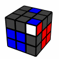
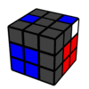
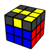
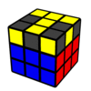
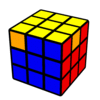

---
title: "AUFについて"
date: "2016-04-13"
order: 0
---
AUFとは**「Adjust U Face」**の略で、そのまま訳すと「U面を調整すること」です。  
OLLやPLL、さらにはF2Lの時に、手順を使う前にU面を回して位置を合わせることをAUFといいます。

AUFは軽視されがちですが、タイムを縮めるためには**AUFを効率よくすることも重要な要素の一つ**です。  
このページでは、PLLを中心に各ステップでのAUFの効率のよいやり方について説明しています。

### F2LのAUF

F2Lの「[F2L基本41手順](/how-to-solve/advanced/f2l-algorithm/)」の中には、最初にUやU'などが書かれているものが多くあります。  
しかし、これらの**UやU'は本当は必要ないもの**です。  
具体的に見てみましょう。

  
これは手順表に載っているQ2の画像です。この位置から**U'R U R' U2 R U' R'**で揃えることができます。

  
しかしこの時は最初のU'が必要なく、**R U R' U2 R U' R'**で揃えることができます。  
この場合、わざわざUして表のとおりに位置を合わせてからU' R U R' U2 R U' R'と回すのは無意味です。Uした直後にU'しているわけですから、完全に無駄な手を回していることになります。

なぜ表のほうの手順は最初にU'を書いているのかというと、これは表の画像をわかりやすくするためです。  
手順表では、コーナーがいちばん前にくるようにU面を調整しています。そのために、**本来なら必要ないAUFを、表では仕方なく書いています。**

上の例のように、手順表の**最初のUやU'などは場合によっては省略することが可能**です。  
実際のソルブではなるべくAUFの回数を減らし、なるべく少ない手順で揃えることが大事です。

### OLL前のAUF

OLLは開始面に合わせる必要があります。  
このとき、**「持ち替えるのではなく、U面を回して合わせる」**方がよいです。  
これも具体的に見てみましょう。

  
これは一番簡単なOLLですね。「**F R U R' U' F'**」で揃えることができます。

  
では、これはどうでしょうか？  
選択肢は２つあります。**「U（トリガー）」**か**「y（持ち替え）」**です。

少し考えれば分かると思いますが、**トリガーと持ち替えを比較した場合、トリガーの方が圧倒的に楽です。**持ち替えはキューブ全体を動かす必要がありますし、失敗して手間取ってしまう可能性がやや高いためです。  
このケースでも、持ち替えるのではなく、トリガーでU面を回して面を合わせるほうが効率がよいと言えます。

初心者向けの解法では、OLL以降も「持ち替えをして面を合わせる」と書かれている場合が多いです。  
これは「初心者にとってはU面を回すよりも持ち替えの方がわかりやすい」「F2Lは持ち替えが必要なため、それと同じ考え方で説明した方が楽である」などの理由によります。  
しかし、OLLやPLLについては持ち替えをせずともトリガーで面を合わせることが可能です。そのため、**LLでは持ち替えではなくトリガーを使ってAUFをするべきです。**

今このページを読んでいる人でも、持ち替えるのがクセになってしまって、ついついLLでも持ち替えをしてしまうという人がいるかと思います。  
揃えるときにAUFについて意識するようにして、少しずつトリガーによるAUFに慣れていきましょう。

### PLLのAUF

PLLのAUFは、**「PLL前のAUF」**と**「PLL後のAUF」**の２つがあります。

**「PLL前のAUF」**は、基本はOLLと同じです。持ち替えではなくトリガーを使ってAUFをします。

ここで問題になってくるのは、下の図のようなケースです。  
  
これはT-perm(n8)です。この図から揃える場合、  
トリガー→**U2 R U R' U' R' F R2 U' R' U' R U R' F' U2**  
持ち替え→**y2 R U R' U' R' F R2 U' R' U' R U R' F'**  
となります。  
トリガーだと2回U2をしなければなりませんが、持ち替えだと1回のy2で済みます。

結論から言えば、このような場合でも**トリガーの方が良い**です。  
持ち替えはホールドをやり直さなければいけないため、持ち替えを多用するとソルブが安定しません。**たとえ2手増えるとしても、持ち替えは極力避けていくべき**であると言えます。

またこれとは別に、PLLでありがちなのは**「ついついAUFして2段目と色を合わせてしまいがち」**という問題です。  
  
こちらも同じくT-permです。この位置からだと最初のAUFは必要なく、**R U R' U' R' F R2 U' R' U' R U R' F' U2**で揃えることができます。  
しかし、**U2して緑色を合わせようとしてしまう**という人は多いのではないでしょうか？ここでU2をしてしまうと、さらにU2をもう1回してから手順をすることになってしまい、無駄な手を沢山回してしまうことになります。

「[PLLの2側面判断](/how-to-solve/advanced/pll2faceidentify/)」を読んだ方はわかるかと思いますが、**2段目と色を合わせなくともPLLを判断することはできます。**  
余計なAUFを減らすためにも、2段目の色に頼らないPLL判断を身に付けることが重要です。

そして**「PLL後のAUF」**についてですが、このAUFは先読みすることが可能です。  
  
これは上と同じT-permの画像ですが、**「手順の後にU2を回せば揃う」ということを、この画像を見ただけで予測することができます。**  
PLLの手順を覚えていれば、これを予測することはそれほど難しくないはずです。

ただ、これをいちいち考えていると余計な時間がかかってしまいます。わざわざAUFの先読みをするのはもったいないようにも感じられますね。  
そこでよい方法は、**手順を回しながら考える**ということです。手順を回している間の時間を利用するのです。

PLLを始める前の状態をよく見ておき、手順を回している間に「最後にどのAUFをすればよいか」ということを考えながら回します。  
そうすれば、**PLLが終わったあとにノータイムでAUFをすることができる**ようになります。

これには多少の訓練を要しますが、練習次第で必ず出来るようになります。練習で意識するようにしてみましょう。

### まとめ

たかがAUF、されどAUF。  
AUFひとつとっても、このようにいろいろなことを考えることができます。ほんのコンマ数秒とはいえ、バカにしてはいけません。  
効率のよいAUFを身に付け、より効率的なソルブを目指しましょう。

**[上級編　トップに戻る](/how-to-solve/advanced/)**
