---
title: "クロスの素早い作り方"
date: "2015-12-15"
order: 0
---
クロスのパターン数は膨大で、全てをパターン化することはまずできません。それ故に、クロスは初心者の方が特につまづきやすい部分となっています。  
しかし、**ある程度の決まった考え方や定石というのはあります。**このページではそれを学び、クロスにかける時間を短く、考えることを少なくすることを目指します。

### クロスで大事なこと

クロスで一番大事なことは何でしょうか？その答えは一つしかありません。  
**「タイムを短くすること」**  
これに尽きます。  
では、タイムを短くするために必要なことは何でしょうか？それは大きく3つあります。

**①手数が短いこと**  
あらゆるクロスは、センター合わせも含めて8手以内、さらに99%以上は7手以内に完成させることができます。  
（参考:[Cross Study - Lars Vandenbergh's CubeZone](http://www.cubezone.be/crossstudy.html))  
単純に考えれば、回す手数が短ければ短いほど有利です。なるべく手数を短くしていくことはとても大事です。

**②回しやすいこと**  
単に手数が短いだけでなく、回しやすい手順であることもとても大事です。クロスは最短手の解がいくつか(多いと数十個ほど)ある場合が多いですし、さらに言えば多少手数を長くしてでも回しやすさを優先した方が結果的にタイムが短くなることもあります。  
そういった中からなるべく回しやすい手順を選べる事、そして同じ手順でも回し方を工夫して素早く回せることが、タイム短縮に重要です。

**③頭を使わないこと**  
人間が一度に考えられる量には限界がありますし、そもそも大会では見る時間(インスペクションタイム)に15秒という制限があり、いつまでも考えているというわけにはいきません。また、いちいち考えながらクロスを揃えていると、どうしても指が遅くなってしまいがちです。  
クロスを頭を使わずに出来るようになれば、指も速くなりますし、その後の先読みも簡単になります。練習の段階ではいろいろ考えながら解いていくことが大事ですが、その行き着く先、理想としては、頭を使わずにクロスが作れるようになることが重要です。

この3点を押さえておくことで、タイムを短くすることができます。

### 「定石」を作ろう

クロスを素早く読み、迷わず揃えるためには、**こういうときはこうするという「定石」を作っておく**のが効果的です。定石を作りそれを使うことで、考えるスピードや効率が上がりますし、考えることが減り、少しずつできることが増えていくようになります。

定石の一例を挙げておきます。あくまで一例ですから、これらを参考に自分で様々な定石を作り上げていきましょう。  
※すべてD面クロス・白クロスで解説しています。

| **２手の定石** |
| --- |
| **　R' F** |
| R面のクロスエッジがまだ揃っていないときは、図のようなエッジを2手で入れられます。 |
| [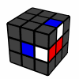](../../../assets/2015/12/crossexampe2-2.gif)　**R' F** |
| 同じ２手の手順ですが、この場合は２個を同時に揃えられます。 |
| [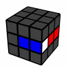](../../../assets/2015/12/crossexampe2-4.gif)　[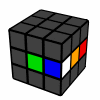](../../../assets/2015/12/crossexampe2-4-2.gif)　**F R** |
| 簡単なパターンですね。 他のすべてのパターンにも言えることですが、右の図のように**センターの位置が違っていても同じパターンだと認識できるようにしておきましょう。** センター合わせは最後に出来るので、センターにとらわれ過ぎないクロス作りを意識しましょう。 |
| [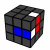](../../../assets/2015/12/crossexampe2-1.gif)　**F R2** |
| センターの位置が違うと気づきにくいパターンです。 |
| [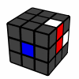](../../../assets/2015/12/crossexampe2-3.gif)　**R2 F** |
| 上のパターンと混同しないよう、注意が必要です。 |
| [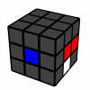](../../../assets/2015/12/crossexampe2-6.gif)　**R F** |
| 奥が白赤、右下が白青のエッジです。逆向きに入っているエッジを処理しつつ、同時に２つ入れることができます。 |
| **３手の定石** |
| [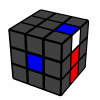](../../../assets/2015/12/crossexampe3-51.gif)　**R' F R** |
| １個のパーツを入れるための、基本的な手順です。同様のパターンでは**R Uw R'**や**R' D' F**なども使えるので、クロスやセンターの位置に応じて使い分けられるとよいでしょう。 |
| [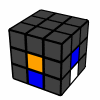](../../../assets/2015/12/crossexampe3-4.gif)　**R' Uw R'**　（奥のエッジは白赤） |
| パーツが反転している（逆向きになっている）ときの基本手順です。**R D' F**なども良いですね。 |
| [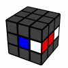](../../../assets/2015/12/crossexampe3-2.gif)　**R2 F R** |
| ３手で２個を入れられる手順です。2手で揃えられるパターンと混同しがちなので、注意しましょう。 |
| [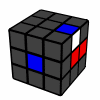](../../../assets/2015/12/crossexampe3-8.gif)　**R' F R2** |
| これも２手のパターンと混同しやすいので注意が必要です。 |
| [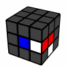](../../../assets/2015/12/crossexampe3-3.gif)　**R F R2** （右のエッジは白青） |
| 反転しているエッジを同時に処理しています。似たようなパターンで**R D2 F**なんかも使えそうです。 |
| [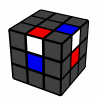](../../../assets/2015/12/crossexampe3-1.gif)　**R' F R'** |
| 嫌な位置にあるエッジを2つ同時にすばやく処理できるので、非常に重宝します。 |
| 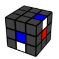　**F' R' F** |
| こちらも嫌なエッジを2つ同時処理できるパターンです。 |
| [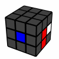](../../../assets/2015/12/crossexampe3-6.gif)　**R2 F R2**　（奥のエッジは白赤） |
| センター合わせまで考慮した、少し応用的な手順です。センターが違うのであれば、普通にDやUwを使って揃えたほうが速いと思います。違わなくても普通にy D2 R' D2の方がいいかもしれない。 |
| [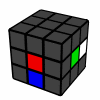](../../../assets/2015/12/crossexampe3-7.gif)　**R2 U'w R**　（奥のエッジは白赤） |
| こちらもセンター合わせを考慮した手順です。 |
| **４手の定石** |
| [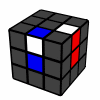](../../../assets/2015/12/crossexampe4-2.gif)　**R' U' R' F** |
| ４手とやや長いですが、非常に使いどころの多いパターンです。 ２手目をUやU2に変えたものも使えますね。 |
| [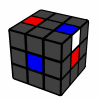](../../../assets/2015/12/crossexampe4-1.gif)　**R' U' F R'** |
| U面にこの向きでエッジが２つ残ることはなるべく避けたい（これ以外のパーツと組み合わせて揃えるなど）のですが、どうしても残る場合はこういった手順が使えます。似たようなもので**R' U2 F R'**なども使えますね。 |

### クロスを読めるようにするには

上級者がクロスを読むとき、何をどのように考えているのでしょうか？これはかなり人によると思います。  
ほとんどの場合、クロスの考え方というのは経験によって養われています。  
これは最初にも言ったように、人間が考えるにはクロスのパターン数というのは多すぎるからです。全ての選択肢を検討することはできないので、**直感に近い感覚でよりよい解を選択することが必要**になってきます。そして、その「直感」は、経験によって大きく鍛えることができます。  
ちょうど将棋に近い感覚でしょうか(将棋のパターン数はもっともっと多いので、比較するのは少し乱暴ですが)。

ですので、一番大事なのは**「たくさんキューブを解いて経験を積むこと」**です。  
「そんな投げやりな」と思われてしまうかもしれませんが、実際のところ**クロスの完璧なメソッドはない**ので、クロスのコツを他人に伝えるのはぶっちゃけ無理です。なので、やっぱり経験が大事です。

とはいえこれだけでは記事として不十分なので、より**効率よく経験を積むための方法**をいくつか書いておきます。

**・インスペクションタイムを制限しない**  
大会では見る時間に15秒という制限がありますが、練習のときは15秒にとらわれず長い時間を使ってクロスを考えてみましょう。たくさん考えることが、技術の向上につながります。  
慣れてくると自然とタイムは縮まります。実際、上級者はクロスだけなら5秒もあればほとんどの場合読み切れます。

**・同じクロスを何回も解く**  
手崩しではなくちゃんとしたスクランブルを用意して、何回も同じクロスを考えてみましょう。いろいろな動きを試すことで、少しずつクロスの「カン」が身についてきます。

**・上級者の解き方を参考にする**  
上級者はたくさんの経験を積んでいますから、そういう人の解き方を参照して自分のソルブにも活かしましょう。  
大会や定例会で直接聞けるのが理想ですね。そうでなくてもYouTubeなどで「example solve」で検索するとソルブ例が結構見つかりますし、他にも様々なサイトで上級者のソルブ例を学ぶことができます。  
参考リンク:[cubesolv.es](http://cubesolv.es)　…公式大会でのさまざまなソルブの解析が載っているサイトです。

**・最短手順を調べる**  
[Prisma Puzzle Timer](https://www.speedsolving.com/forum/showthread.php?25790-Prisma-Puzzle-Timer)などのタイマーは、クロスの最短手を出す機能がついています。これを参考にしてみましょう。より短い解法を見て、自分なりに考え方を編み出していきましょう。  
特に長い手数が必要なパターンだとコンピュータの解法はびっくりする位キレイなので、自分のソルブに取り込むことができれば大きな実力アップに繋がるでしょう。

### 回しやすさを考える

同じ手順でも、回し方によってタイムは大きく変わります。素早くクロスを終えるためには、より回しやすいやり方を考えることが大事です。  
これも一概にどうと言えるわけではないので、基本は慣れです。1回1回のソルブに、より回しやすい解法へという意識を持つようにしましょう。

具体例は最後のexample solvesを見てみてください。

### センター合わせについて

最後にセンター合わせが残った場合や手順の途中でD面を回す必要がある場合、Uwを用いる方法とDを用いる方法の2つがあります。  
この２つは、**場合に応じて回しやすい方を選択できるようになる**ことが大事です。普段からどちらかに偏りすぎないようにする方がよいでしょう。  
ただ、**最後のセンター合わせについてはなるべくDを使うほうが良い**とされています。  
この理由は、U面が移動しないのでF2Lのパーツが動きづらく、先読みがしやすくなるからです。  
クロスを作るのに慣れてきたら、このようにF2Lへの繋ぎも意識したクロス作りをしていけるようにしましょう。

(手数的なことを考えれば、なるべくセンター合わせが残らないよう、エッジと同時にセンターも合わせるようにするのが良いのは言うまでもないことですが。)

### example solves

最後に、筆者が普段クロスをどのように揃えているのか、いくつか例を挙げてみます。  
これを参考にしつつ、自分なりにいろいろ考えてみてください。

※自分のクロス色をD面にしてスクランブルしてください。  
※画像は白をD面、青をF面にしています。

**例１：F2 R' D2 F' B' U2 R' D L B2 U F2 L2 D R2 B2 U' D2 R2 U'**  
[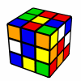](../../../assets/2015/12/F2-R-D2-F-B-U2-R-D-L-B2-U-F2-L2-D-R2-B2-U-D2-R2-U.gif)  
**解法：L B U R' U' R' F**

**解説：**最初の2手で2個を揃えるのはすぐに思いつくでしょう。  
残りのパターンが4手の定石になっています。これにうまく繋げるために、最初の2手はあえて後ろで揃えています。  
回してみると結構繋がりがよいのが分かると思います。  
この他にも、少し読む難易度は上がりますが**L R' B y U R B'** なども良さそうです。やや回しづらいですが1手少なくなっています。

**例２：B2 R2 U2 B R2 F U2 R2 U2 F U R D R2 D' L2 U B' F**  
  
**解法：y R' F U'w F L' D2**

**解説：** 1個すでに入っているものの、かなりややこしいですね。マルチクロスが可能な人はU面でやった方がいいと思います。  
1手で1個揃えたあと、2手目で反転しているエッジをあらかじめ移動させておきます。3手目で残り2つともいい位置に持ってくることができます。

**例３： B2 U F2 U F2 D2 F2 R2 D' F2 U R D' U2 B F' D' F2 R' F2 L' D  
[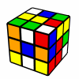](../../../assets/2015/12/B2-U-F2-U-F2-D2-F2-R2-D-F2-U-R-D-U2-B-F-D-F2-R-F2-L-D.gif)**  
**解法： U L' B D R F D'　や　y2 U R' F y D F L D' など**

**解説：**上の2つは解法は同じですが回し方が違います。この2つに限らず、自分にとって回しやすい方法を選択できるとよいですね。  
最初の3手で1個を揃え、そのあと1手で移動、2手で2個を揃えます。最後にセンターを合わせます。

**例４： F2 D2 R2 U' R2 B2 U R2 D R2 D2 R' U' B' D' F2 D U2 F R L'  
[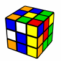](../../../assets/2015/12/F2-D2-R2-U-R2-B2-U-R2-D-R2-D2-R-U-B-D-F2-D-U2-F-R-L.gif)**

**解法： y2 R' B' R2 F' D U' R' F**

**解説：**最初の3手は定石パターンです。2手目のB'は右薬指で回しています。  
4手目のF'もポイントですね。あえて1手無駄な動きを挟むことで、その後を揃えやすくしています。  
ちなみにこの解法は8手ですが、Optimal（最短）は7手です。**F' L B D R D2 F**などが一例ですが、これを思いつくのはかなり難しそうですね……

### example solves by 大村 周平

[大村 周平](/author/#大村周平)さんより、クロスのexample solve動画をご提供いただきました。

**[クロス+F2L#1 インスペクションタイム思考　実践20例](https://www.youtube.com/playlist?list=PLLdgupihR8TdDoaASSrVqqlXcxVVn_lYy)**  
動画でわかりやすく解説されていますので、ぜひご覧ください。

（2015/12/03　文責：[HATAMURA](/author/)）
