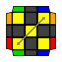
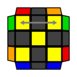
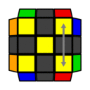
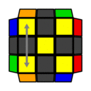
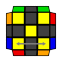
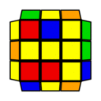

---
title: "OLLでのCP判断"
date: "2017-11-05"
order: 0
---
OLLは基本的に手順を覚えてそれをこなすだけなのですが、もしOLLをやっている間にPLLが分かっていれば、その分判断の時間を短縮できます。  
この記事での目標は、**OLL開始時にCP、つまりPLLのコーナー部分を一緒に判断・先読みしてしまおう**というものです。  
いくつか新しい概念が登場しますが、判断する事が増えるだけで**手順は一切増えません。**普段の練習ソルブの中で覚えていくことができますので、ぜひ挑戦してみましょう。

### コーナーPLL（CP）について

通常の3x3部門におけるCPとは、LLのコーナーの位置・およびそれを合わせる行程のことを指します。  
要は初級編・[中級編のステップ6](/how-to-solve/intermediate/step6plus/)と同じだと思っていただければOKです。

これを読んでいる方ならご存知だとは思いますが、CPは3パターンしかありません。  
すなわち、  
**無交換(skip/solved state)→Skip,U,H,Z-perm  
  
対角交換(diagonal swap)→E,N,V,Y-perm  
  
隣接交換(side swap)→A,F,G,J,R,T-perm  
**

この３つとなります。  
実際はここにエッジの交換も絡んでくるわけですが、この記事でのとりあえずの目標はこの3つのパターンの違いを理解することです。

### CP判断のメリット

CPがあらかじめ分かっていることで、少しだけですがPLLの判断が簡単になります。  
CP判断をやっていないと、どのPLLが出るか全く分からない状態でPLLに臨むことになりますが、例えば「コーナーは対角交換だ」とあらかじめ分かっていれば、来るのはE,N,V,Yのみに絞られるのでその4つだけ考えればよい事になり、少しだけ判断をするのが楽になります。

PLLの選択肢が絞れるというのは意外に重要で、脳の処理量を減らせるだけでなく、判断する上での心の準備にも繋がってきます。  
あらかじめ「無交換PLLが来る！」と分かっているだけで、実際の判断が思った以上に楽にできるようになります。（この辺は実際にやってみないと中々実感しづらいですが……）

### 注意点

先のことがちょっと分かるだけであり、手順自体が簡単になったりするわけではないので、CP判断はあくまでオマケでしかないことに注意してください。  
CP判断のためにわざわざ後ろの面を見たり、わざわざ止まってCPを判断することは全くの無意味です。そこで手間をかけるのであれば、さっさとOLLの手順をこなしてPLLを判断するほうがよっぽど楽だし速いです。  
**CP判断はあくまで「できればラッキー」程度のものである**ということを理解しておきましょう。

では、やり方を説明していきます。

### ①対になる関係のパターンを覚える

CPを覚えるために、まずはOLLの時点での色配置のパターンをすべて把握しておく必要があります。  
コーナーOLLはskipも含めて8種類あり、各コーナーOLLについて6種類のCPがあるため、**全部で48種類のパターン**を把握することになります。

「あれ、さっきCPは3パターンって言ってなかったっけ？」と思われた方もいるかと思いますが、これにはワケがあります。  
実はコーナーOLL時点のCP判断では、**隣接交換を「どの2パーツが交換しているか」によって４パターンに分類します。**  
  
そのため、合計3パターンではなく6パターンを覚えることになるのです。

では、具体的なパターンをみていきましょう。  
表を用意しましたので参考にしてください。

**[CPパターン一覧表（googleドキュメント形式）](https://docs.google.com/document/d/1AWW-F-nIwFYLS-ZKlLrFArZed-p_Qqj8FNrC22fl6CM/edit?usp=sharing)  
[OLL CP一覧表](../../../assets/2017/11/9cc7e58c724bc45687e4ecf651e58b9a.pdf)**

「なにが違うのか分からん……」という方が多いかと思いますが、今はCPをみているので黄色だけではなく他の色も見る必要があります。  
ポイントは、[PLLの2側面判断](/how-to-solve/advanced/pll2faceidentify/)と同じく**「対面色かどうか」という点に注目してみる**ことです。

各パターンの名前は覚える必要はありません。ここで重要なのは、**対になっているパターンの組み合わせを覚えること**です。  
とはいえ多分これだけでは何を言っているか分からないと思うので、とりあえず次に行きます。

### ②自分のOLL手順がどのパターンなのか把握する

次にすることは、自分の使っているOLL手順が①にあげた６つのパターンのどれに該当するのかを把握することです。  
判別方法は、「その手順をこなした時に、PLLスキップが起こる時のパターン」です。

例えば、一番簡単なT型の6手OLLである**「F R U R' U' F'」**という手順について考えてみましょう。  
PLLスキップが起こる場合を調べるには、その手順を逆に回せばOKです。今回は「F U R U' R' F'」と回して確認します。  
  
この状態を、先ほどの表と見比べてみます。すると、これはU-caseのDiagonal swapと同じであることが分かります。  

このように、各OLLの手順がどのCPパターンと同じなのかを調べていきます。  
同じOLLパターンでも手順によってCPは異なるので、必ずひとつひとつ手順を調べて確認してください。

### ③判断方法

「CPパターンとその関係性」「自分のOLL手順のCPパターン」が頭に入ったら、あとは簡単です。

**CPが同じパターン→無交換（あたりまえ）  
CPが対のパターン→対角交換  
それ以外→隣接交換**

となります。

具体的な例を考えてみましょう。先ほどと同じくT型の6手OLLについて考えていきます。  
この手順のCPはdiagonal swapなので、対のパターンであるno-swapでは対角交換が発生することになります。  
  
このようなパターンでは、OLLの後に対角交換PLLのどれかが来ると判断出来るわけです。  
その他のケースでは、全て隣接交換となります。（↓は一例）  

このような判断をOLLの手順を回す前、**OLLの判断と一緒に行う**ことで、PLLで来るパターンをあらかじめ予測できるというわけです。

なお、隣接交換の4つ（どの面に交換が発生するのか？）を区別することはあまり意味が無いのでしなくていいです。交換位置が分かってもPLLの絞り込みができるわけではないので……  
（さらに余談：3x3ではあまり意味がありませんが、2x2の[Varasano(Ortega) Method](/speedcubing/2x2x2/ortega/)の場合はめちゃくちゃメリットが大きく、必須発展テクの一つとなっています）

### 発展的おまけ：OLLCPについて

CPパターンによってOLLの手順を使い分けることで、対角交換を回避したり、意図的にコーナーskipを発生させることができます。  
このテクニックはOLLとCPを同時にやってしまうということで、**OLLCP**と呼ばれています。

ただし、57の各OLLパターンについて最大6種類の手順を覚え直すことになるので、手順量が膨大になりますし、判断もめちゃくちゃ大変です。その割にメリットが「PLLがU、Z、Hのどれかになる」というだけなので、**正直かなり割に合わない**テクニックです。  
回しにくいOLLCP手順を使ってCPskipを起こしても、結局エッジPLLはやらないといけないわけです。それだったら最初から回しやすいOLLを使ってPLLをやった方が確実だし速いですよね？

ただ逆に言えば**「回しやすさがほとんど変わらない手順であれば使い分けるメリットは大いにある」**ということなので、例えば2つの手順のどちらを使うか迷っているというのであれば、「両方覚えてCPによって使い分ける」といった事もできます。  
全部覚えるのではなく、回しやすいいくつかの手順（パターン）だけ覚えて使い分けるというテクニックは多くの上級者が取り入れていますので、検討してみるとよいでしょう。

とはいえ基本的にOLLは1パターンだけ覚えておけば十分です。使い分けにこだわるあまり、かえって判断に時間を食うということがないように注意しましょう。

[**上級編　トップに戻る**](/how-to-solve/advanced/)
