---
title: "PLLを覚える順番"
date: "2015-04-30"
order: 27
---
PLLは全部で21パターン、左右対称を同じものとして数えも13パターンあります。一気に全部覚えるのは大変なので、一つずつ覚えていくのが良いでしょう。  
ただ結構パターン数が多いので、どれから覚えようか迷ってしまいますよね。  
そこで、このページではPLLについて「どの順番で覚えればよいか」を解説します。

※このページで挙げる「順番」は絶対的なものではなく、あくまで目安です。「この手順を先に覚えたい！」と思ったら、先に覚えてしまっても全く問題ありません。  
特に順番にこだわりがなければ、このページの順番で覚えていくのをおすすめします。

### 　優先順位について

基本的には、  
**・見た目が特徴的で、他のパターンと見分けやすいもの  
・手順が簡単なもの**  
を先にしています。  
こういったパターンを先に覚えることで、タイムを効率よく伸ばせます。  
(逆に言うと、最後のほうは覚えるメリットが少ないということになりますが……)

### 　覚える順番

いよいよ本題です。  
優先順位が高いものから先に掲載しています。

| 1.U-perm | [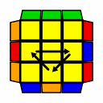](../../../assets/2015/02/7-2.gif)[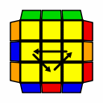](../../../assets/2015/02/7-1.gif) |
| --- | --- |
| 初級編で覚えた手順。 コーナーが全て揃っているので見分けやすい。 エッジのみを動かす、基本となる手順。 |  |
| 2.T-perm | [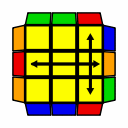](../../../assets/2015/02/plln8T.gif) |
| 初級編で覚えた手順。 コーナーが動くパターンの中で、最も回しやすい。 揃っている部分が特徴的であり、左右対称パターンも無いため、判断が簡単。 |  |
| 3.Y-perm | [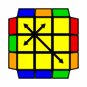](../../../assets/2015/02/plln15Y.gif) |
| 中級編で覚えた手順。 コーナーのペアが1個も出来ていないパターンの中で、最も回しやすい。 揃っている部分が特徴的であり、左右対称パターンも無いため、判断が比較的簡単。 |  |
| 4.H-perm | [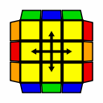](../../../assets/2015/02/7-4.gif) |
| 中級編で覚えた手順。 コーナーが全て揃っていて見分けやすい上に、開始面がどこでもいいので間違えにくい。 ただ出現確率は低い。 |  |
| 5.Z-perm | [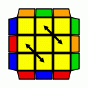](../../../assets/2015/02/7-3-e1491833130704.gif) |
| 中級編で覚えた手順。 コーナーが全て揃っているので見分けやすい。 |  |
| 6.J-perm | [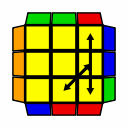](../../../assets/2015/02/plln13Jb.gif)[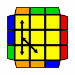](../../../assets/2015/02/plln14Ja.gif) |
| パッと見でたくさん揃っているので見分けやすい。 手順が回しやすい。 |  |
| 7.A-perm | [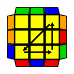](../../../assets/2015/02/plln3Ab.gif)[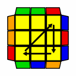](../../../assets/2015/02/plln4Aa.gif) |
| エッジが全て揃っているので見分けやすい。 コーナーのみを動かす、基本となる手順。 中級編手順だとZ-permが残るアンラッキーパターンなので、覚えるとお得。 持ち替えは必要だが、手数が短い。 |  |
| 8.F-perm | [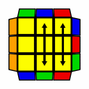](../../../assets/2015/02/plln10F.gif) |
| 1ラインが揃っているので、比較的見分けやすい。 中級編手順だとH-permが残るアンラッキーパターン。 手順が長い。 |  |
| 9.V-perm | [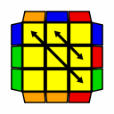](../../../assets/2015/02/plln9V.gif) |
| 揃っている固まりがあるので、比較的見分けやすい。 ただし、A-permと見間違えやすいので注意が必要。 中級編手順だと開始位置によってはH-permやZ-permが残ることのあるパターン。 手順が回しにくい。 |  |
| 10.R-perm | [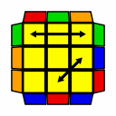](../../../assets/2015/02/plln11Rb.gif)[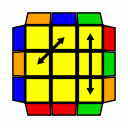](../../../assets/2015/02/plln12Ra-e1462626887300.gif) |
| 全体的にあまり揃っていないので、判断が少し難しい。 手順があまり回しやすくない。 |  |
| 11.E-perm | [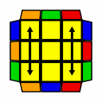](../../../assets/2015/02/plln7E.gif) |
| どこにもペアがない上に開始面がとても分かりづらいので、判断がとても難しい。 手順が長いうえにあまり回しやすくない。 |  |
| 12.G-perm | [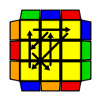](../../../assets/2015/02/plln16.gif)[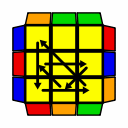](../../../assets/2015/02/plln17.gif)[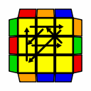](../../../assets/2015/02/plln18.gif)[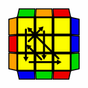](../../../assets/2015/02/plln19.gif) |
| 全体的にあまり揃っていない上に4パターンもあるので、判断が難しく手順を間違えやすい。 手順があまり回しやすくないが、対称手順と逆手順で全部処理できるので、人によっては全パターンをすぐ覚えられる。 出現確率は高いので、覚えればお得。 |  |
| 13.N-perm | [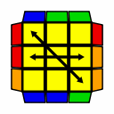](../../../assets/2015/02/plln20Na.gif)[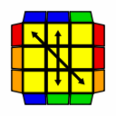](../../../assets/2015/02/plln21Nb.gif) |
| 手順が長い上に回しにくい。 見た目が特徴的かつ開始面を気にしなくてよいため判断はしやすいが、左右対称パターンの判別に迷いやすい。 出現確率が低い。 |  |

参考リンク:[PLLの確率 - roudai.net](http://roudai.net/pll/pll-chances/)

[上級編トップへ戻る](/how-to-solve/advanced/ "上級編")
