---
title: "ステップ１　下段のエッジをそろえる"
date: "2018-06-13"
order: 10
---
まず最初は、ある色のセンターパーツを中心とした、下段の4つのエッジをすべてそろえます。

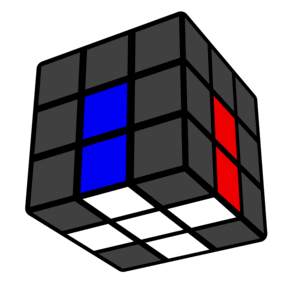  
この形が十字に見えることから**「クロス」**とよく呼ばれていますので、このページでもそう呼ぶことにします。

また、これ以降のページでは全て中央が白色の面に、白色のクロスを作ることを前提に話を進めていきますが、他の色の方が好きであれば、白以外の色から始めても構いません。  
その場合は、画像の色を適宜読み替えてください。

注意点として、かならず**白色だけではなく、側面の色も合わせる**ようにしてください。  
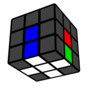  
このように、白色の十字はできていても、側面が合っていなければ間違いとなります。

考え方のポイントとしては、ステップ０でも説明したように、**パーツ単位で考える**ことです。  
例えば、ここの紫色で示した部分には、「白と青のエッジパーツ」が入ることになります。  
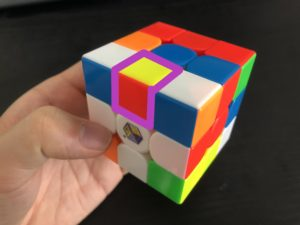  
ですので、まわりから「白と青のエッジパーツ」を見つけてきて、  
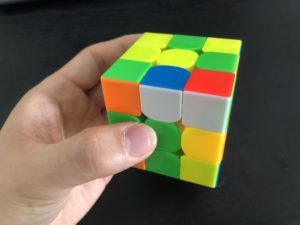  
それをこの場所に入れる、  
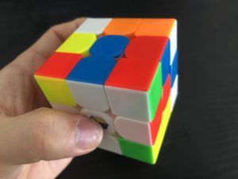  
という考え方でそろえていきます。

また、当たり前のことですが、場所だけ合わせればいいわけではなく、向きも合わせなければならないので、注意が必要です。  
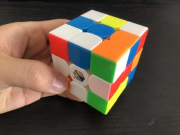  
写真では、場所は合っているものの、向きが間違っている状態になります。

### そろえ方

**決まったやり方はありません。**とにかくクロスをそろえられればなんでもOKです。  
自力でも割と何とかなると思いますので、いちど頑張って考えてみてください。

しょっぱなからなかなか難しいとは思いますが、安心してください。  
実は**M2Lメソッドでは、このステップ１がいちばん難しい**です。  
逆にこれさえ乗り切れば後はずっと簡単です。

どうしても分からないという方は、下にちょっと簡単なやり方を説明しているので、そちらを参考にしてみてください。

### ちょっと簡単なやりかた……デイジークロス

何も知らない状態で、いきなりパーツの位置関係を考えながらそろえるのはなかなか大変だと思います。  
そこで、色だけ考えればそろえられる簡単なそろえ方、名付けて「デイジークロス」を紹介しましょう。

クロスを２つのステップに分けてそろえます。  
まずは、中央の色が白色の面の反対側、**黄色の面に、白色のエッジパーツをすべて集めてきます。**  
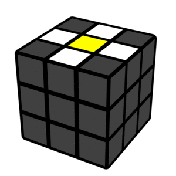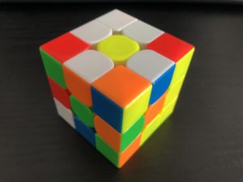  
このとき、側面の色は考えなくて大丈夫です。  
位置関係を気にしなくていいので、いきなりクロスをそろえるよりも、だいぶ簡単だと思います。

集め終わったら、次はセンターが黄色の面を横に回して、どれか１つの白色エッジの側面とセンターの色が合うようにします。  
[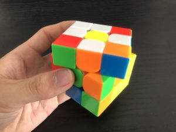](../../../assets/2018/06/17e089ee7d4a9cde890abfa36f721beb.jpg)  
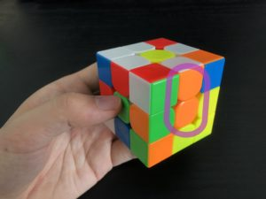  
そのあと、合わせたエッジのある面を180度クルっと回せば、エッジパーツが白色の面に移動し、クロスを１つそろえられます。  
↓gifアニメ（動かない場合はタップしてみてください）  
[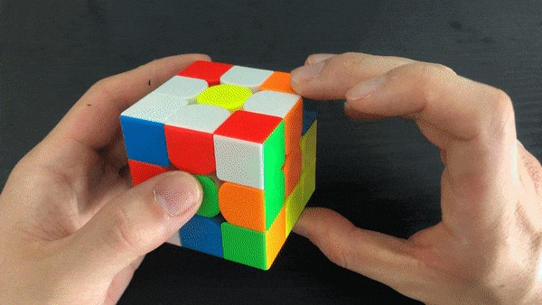](../../../assets/2018/06/ezgif.com-optimize.gif)  
残り３つも、同じ要領で「側面の色を合わせる→180度回して白色の面に持っていく」を繰り返せば、簡単にクロスをそろえることができます。

このデイジークロスは、わかりやすい反面、普通にそろえるよりも手数が多くなりますので、慣れてきたらデイジークロスを使わず、直接クロスをそろえられるように頑張ってみましょう。

### 小ネタ

この「小ネタ」のコーナーでは、ちょっとした豆知識や、覚えていると役立つ応用テクニックなどを説明していきます。  
すぐに全部を理解する必要はないので、もっと速くなりたいな～と思ったら読んでみてください。

・クロスは、**どんな状態からでも8手以内に必ずそろえられる**ことが分かっています（180度は1手として計算）。  
最初のうちは何十手もかかってしまうとは思いますが、慣れてきたらより効率よく、少ない手数で揃えられるよう試行錯誤してみましょう。

・デイジークロスという名前は、黄色のセンターの周りに白色のエッジがある状態が、ヒナギク（daisy）の花に似ていることから名づけられています。  

### クロスが完成したら

クロスが完成したら、十字が下になるよう持ち替えて、次のステップへ進みましょう。  

**[ステップ２　に進む](/how-to-solve/beginner-m2l/step2/)  
[ステップ０　に戻る](/how-to-solve/beginner-m2l/beginner-m2l-0/)  
[初級編　トップへ戻る](/how-to-solve/beginner-m2l/)**
