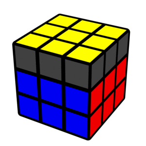
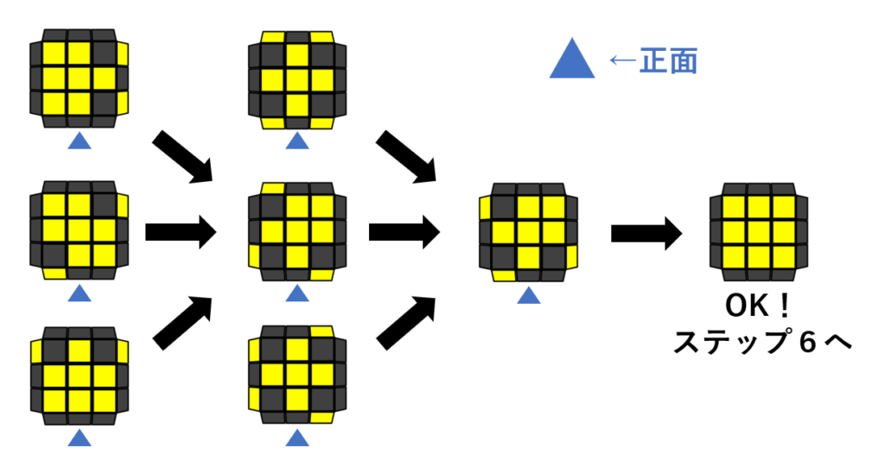
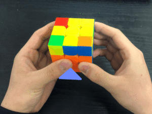
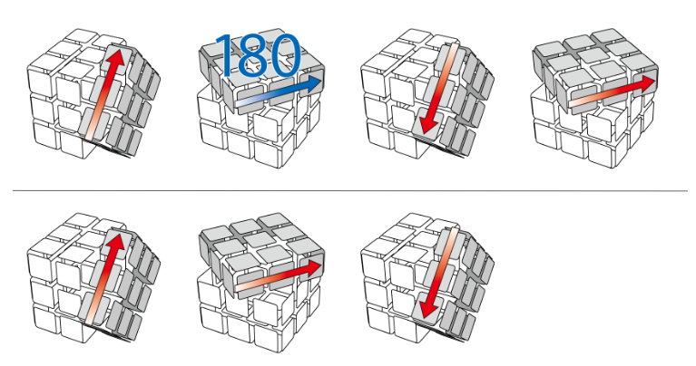
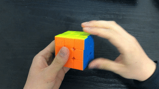

---
title: "ステップ５　上段コーナーの向きをそろえる"
date: "2018-06-16"
order: 50
---
ステップ５では、上段のコーナーの向きをそろえます。  
  
これにより、上段はすべて黄色になり、上段の側面だけが残った状態になります。

### そろえ方

この時点で、コーナーの状態は７パターンあります。  
フローチャートを用意しましたので、これに従って揃えていってください。  
**画像はすべて上から見た図です。下の三角がある所が正面です。**  
  
まずは、自分が今どの状態なのかを確かめましょう。  
自分のパターンがどれなのか分かったら、**画像の通りの向きに持ち替えてください。**  
イメージとしてはこんな感じです。  
  
持ち替えたら、下の手順を回してください。  
  
そのあとは、もう一度画像の向きに持ち替えて……をくり返してください。

### 回し方

<iframe width="560" height="315" src="https://www.youtube.com/embed/hnazV3UlDtA" frameborder="0" allow="accelerometer; autoplay; encrypted-media; gyroscope; picture-in-picture" allowfullscreen=""></iframe>  
かなりシンプルな手順です。  
これまでに出てきた「ダブルトリガー」と「基本手順右」を組み合わせれば、簡単に回せると思います。

### 小ネタ

・もしかすると、上のフローチャートに載っていないパターンになっていることがあるかもしれません。  
ですが、普通にルービックキューブをやっていれば上の７パターン以外は絶対に出てきません。  
その場合、「過去にシールを張り替えた」「過去に分解して組みなおした」「コーナーパーツだけが勝手に回ってしまった」などの可能性が考えられます。  
特に**競技用ルービックキューブでは、コーナーパーツ1個が勝手にクルっと回ってしまうことがよくあります。**  
  
（↑動かない場合はクリックしてみてください）  
この場合は、どこかのコーナーを自分でクルっと回すか、いちど分解して、上の７パターンのどれかに直してください。

・上のフローチャート以外のルートで揃える方法も一応あります。手順の回数は変わらないか多くなるはずなので、特にこだわりがなければ上のフローチャートを使ってください。

**[ステップ６　へ進む](/how-to-solve/beginner-m2l/step6/)  
[ステップ４　へ戻る](/how-to-solve/beginner-m2l/step4/)  
[初級編　トップへ戻る](/how-to-solve/beginner-m2l/)**
