---
title: "中級編手順まとめ"
date: "2022-01-04"
order: 5
---
中級編で使用する手順を一覧にしました。手順だけ見たい場合にどうぞ。  
このページをブックマークなどしておくと便利かと思います。

**ステップ４＋　上面の十字（エッジの向き）を揃える**

| **4+-1** | 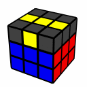 | F R U R' U' F' |
| --- | --- | --- |
| **4+-2** | 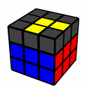 | Fw R U R' U' F' w |
| **4+-3** | 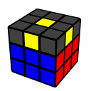 | F R U R' U' F' Fw R U R' U' F'w |

**ステップ５＋上面のコーナーの向きを揃える**

| **5+-1** | 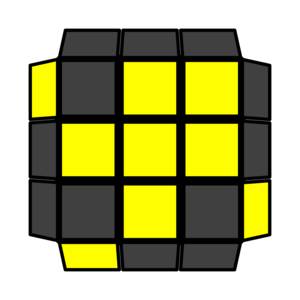 | R U2 R' U' R U' R' |
| --- | --- | --- |
| **5+-2** | 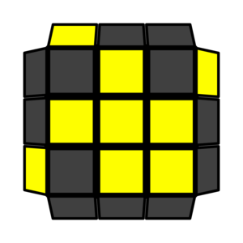 | R' U2 R U R' U R |
| **5+-3** | 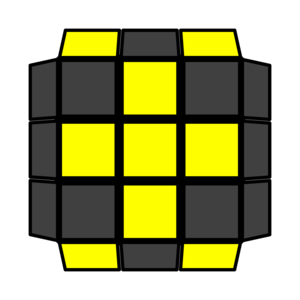 | R U2 R' U' R U R' U' R U' R' |
| **5+-4** | 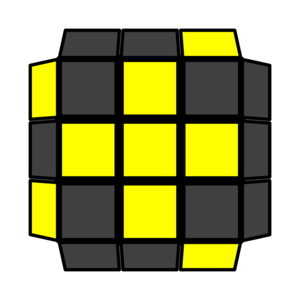 | R U2 R2' U' R2 U' R2' U2 R |
| **5+-5** | 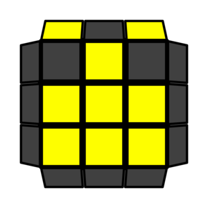 | R'2 D' R U2 R' D R U2 R |
| **5+-6** | 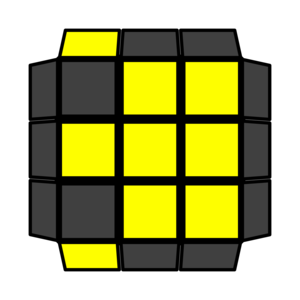 | Rw U R' U' R'w F R F' |
| **5+-7** | 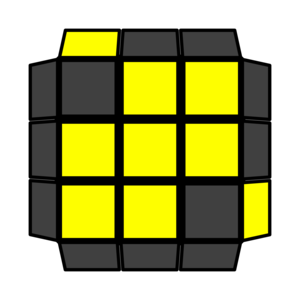 | x' R U' R' D R U R' D' |

**ステップ６＋　３層目のコーナーを揃える**

| **6+-1** | 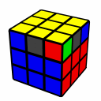 | R U R’ U’ R’ F R2 U’ R’ U’ R U R’ F’ |
| --- | --- | --- |
| **6+-2** | 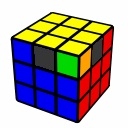 | F R U' R' U' R U R' F' - R U R' U' R' F R F' |

**ステップ７＋３層目のエッジを１Lookで揃える**

| **7+-1** | 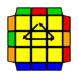 | R' U R' U' R' U' R' U R U R2 |
| --- | --- | --- |
| **7+-2** | 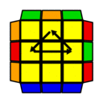 | R2 U' R' U' R U R U R U' R |
| **7+-3** | 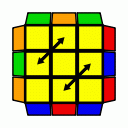 | U' M' U M2' U M2' U M' U2 M2' |
| **7+-4** |  | M2 U M2 U2 M2 U M2 |

[中級編　トップへ戻る](/how-to-solve/intermediate-m2l/)
