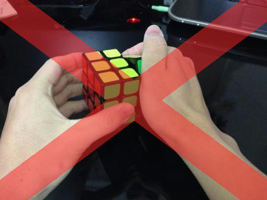
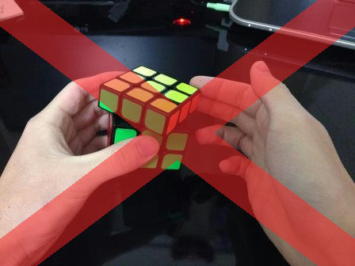
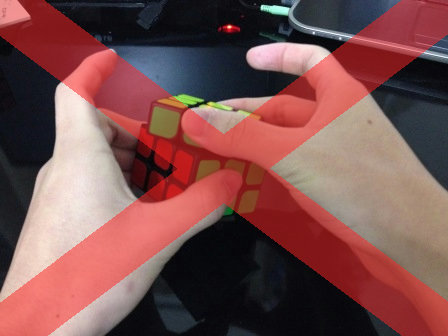
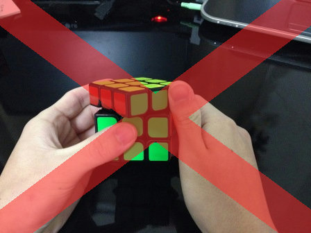
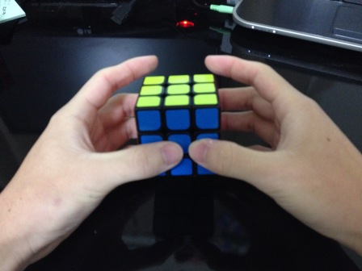
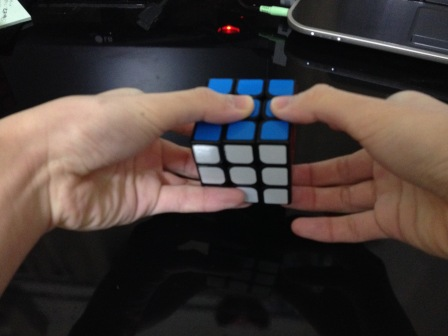
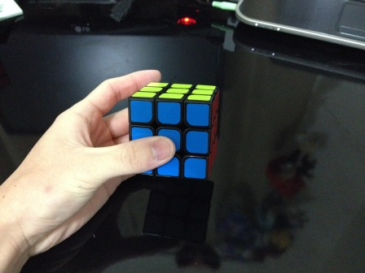
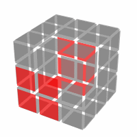
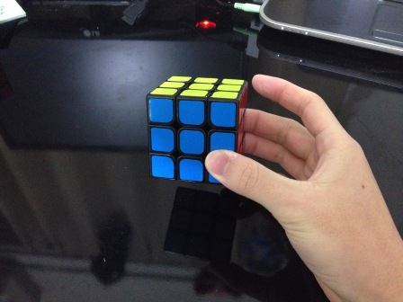
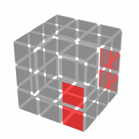

---
title: "正しい持ち方、回し方を身につけよう！"
date: "2015-02-10"
order: 15
---
テレビや動画サイトで、ルービックキューブを指を使って素早く回しているのを見た事はありませんか？  
これは**FSC（フィンガーショートカット）**といって、ルービックキューブを素早く回すためのテクニックなのです。  
FSCを正しく身につける事によって、誰でもルービックキューブを素早く回せるようになります。

### 正しい回し方のために

正しい回し方で素早く回すためにはまず、**回しやすいルービックキューブを使う**ことが必要です。  
詳しくはこちらを見てください。

**[回しやすいルービックキューブを使おう！](../easy-to-move)**

**固くて回しにくいルービックキューブを使っていると、正しい回し方を身につけることができないどころか悪い回し方のクセがついてしまうことさえあります。**  
一旦クセがついてしまうと直すのはとても大変なので、最初から回しやすいキューブで練習するようにしましょう。

### こんな回し方をしていませんか？

キューブを素早く回すためには、正しい回し方を知っていることが必要です。  
しかしその前に、「このような回し方はダメ」というものを挙げておきます。

**※間違った回し方で練習すると悪いクセがついてしまい、成長のさまたげになってしまいます。特に始めたてで、身近にうまい人がいない場合は注意しましょう！間違っていても誰も教えてくれないので、間違った回し方をずっと続けてしまう可能性があります！※**

**・手全体で掴んで回す**

キューブに親指がベタッと付いた状態で回すのは良くありません。これは余計な力が入りすぎです。  
特に回転が硬いキューブを使っている人にありがちな回し方です。回転が軽いキューブを使えば、こんなに力を入れて回す必要はありません。

**・キューブから手を離して回す**

回すたびに指から手が離れてしまうような回し方はよくありません。  
たくさんの回転を連続して行うために、なるべくキューブと指が近い状態で回すようにしましょう。

**・上1段を掴んで下の段を回す**

完全1面や中段を揃えるときにやってしまいがちな回し方です。  
これも1手ごとに手からキューブが離れてしまうので良くありません。

**・U'を右手親指で押し込んで回す**

U'を右手親指で押し込んで回すような回し方になってはいけません。  
これについても、1手ごとに手からキューブが離れてしまうために回転の流れが悪くなってしまい、結果として遅くなります。  
**この回し方に限っては手順によっては使ったほうがよい場合もありますが、多用は避けるべきです。**

### 基本の持ち方、回し方

さて、それでは「正しい回し方」を説明していきます。

**・正しい持ち方**  
正しく回すために、まずは正しい持ち方を身につけましょう。  
写真のような持ち方が基本の持ち方になります。

特に大事なポイントは３つあります。

**①親指、中指、薬指の三本指（左手は＋小指）で持つ**  
人差し指はキューブを回すのに使いますので、力を入れず軽く触れる状態にします。  
また、手全体で掴むのではなく、指先〜第1関節あたりの部分で支えるような持ち方をしましょう。

左手の小指を下の面に当てておくと、しっかり安定して持てます。  
「右手小指は使わないの？」と思うかもしれませんが、この理由は次で説明します。

**②主に左手でキューブを支える**  
左右の手は少し違う持ち方をします。**これは、それぞれの手で役割分担をする**ためです。  
右手は主にキューブを回す手、左手は主にキューブを支えながら、余計な部分が回らないよう押さえる手になります。  
ただしこれはあくまで基本の状態で、実際には**回す場所に応じて左右の役割を入れ替えながら回していきます。**

左手は、下の図で示す部分を押さえるように持ちます。  
これにより、キューブをしっかり安定させ、かつR面・U面・F面以外の場所が間違って回らないようにします。

右手は、下の図で示す部分を持ちます。  
これによりR面とU面をすぐ回せる状態になるわけです。

先程も言いましたがこれは基本の状態で、実際には**回す場所に応じて左右の役割を入れ替えながら回していきます。**

**③力を入れすぎない**  
力が入りすぎると回転が引っかかってしまったり、変なところが回ったりしてしまって正しく回せません。  
ただし、逆に力を抜きすぎるとこれも変なところが回ってしまったり、キューブが手から落ちてしまったりしますからよくありません。  
「回していてキューブがふらつかない程度の軽さ」がベストです。とはいえ最初はよく分からないと思いますので、あまり気にしなくてもいいでしょう。  
**とりあえず「力が入り過ぎないように」というのだけ意識しておいて下さい。**

他にもいくつかポイントはありますが、とりあえずはこの３つを守るようにしましょう。

次からは具体的な回し方です。動画を見ながら実践していってください。

**・R面、L面の回し方**

<iframe src="https://www.youtube.com/embed/DtlMVvqYPu0" width="560" height="315" frameborder="0" allowfullscreen="allowfullscreen"></iframe>

まあいわゆる普通の回し方ですね。  
ポイントとしては、何度も書いていますが**「指先で回す」**ということを意識しましょう。

**・U面、F面、B面の回し方「トリガー」**

<iframe src="https://www.youtube.com/embed/LugR0eb4lpU" width="560" height="315" frameborder="0" allowfullscreen="allowfullscreen"></iframe>

拳銃の引き金(トリガー)を引くような動きなので、こう呼ばれます。  
指を後ろに当て、指を曲げて手前に引き込むように回します。  
**U面を回す時は基本的にすべてこの回し方**です。

また、F面やB面を回す時にも使います。  
右手の持つ位置を変えることで、FやB'といった回転をすることもできます。  
（左手は基本的には支える手なので、この回転はあまり使用しません。）

**・F面の回し方「はじき上げ」**

<iframe src="https://www.youtube.com/embed/6n820KuA1p8" width="560" height="315" frameborder="0" allowfullscreen="allowfullscreen"></iframe>

右手の親指を使って、F'の回転をすることができます。

下から弾き上げるような動きで回します。少しコツがいるので、何度か練習してみましょう。  
ただし、この回し方は右手がキューブから離れてしまうため、**基本的にはやらない方がいい回し方**です。手順のつながりが悪くなるため、多用しないようにしましょう。  
**基本的には持ち替えてRやLの回転にした方が速いし回しやすいです。３段目以降の手順など、固定化された手順の中でだけ使うべきです。**

**・U面の180度回転「ダブルトリガー」**  
上の面を180度回すときは先ほどのトリガーを2回するのでもOKですが、もっと速い方法があります。

<iframe src="https://www.youtube.com/embed/ayQzOsHfVio" width="560" height="315" frameborder="0" allowfullscreen="allowfullscreen"></iframe>

このように、**人差し指と中指を使って、2連続でトリガーをする**ことができます。  
これをダブルトリガーといいます。  
これもすぐには出来ないので、少し練習が必要です。  
コツは、中指を離さなければならないので、薬指でしっかりキューブを支えることです。

**・D面の回し方「メディカルトリガー」**

<iframe src="https://www.youtube.com/embed/yaxIqqcXKLU" width="560" height="315" frameborder="0" allowfullscreen="allowfullscreen"></iframe>

ステップの途中で、D面を回すことがありますよね。  
これもトリガーを使って回すことができます。  
**薬指を使うことで、トリガーを使ってD面を回す**ことが出来るのです。  
これは意外と難しくないので、ぜひ使えるようになってください。

**・M列の回し方**

<iframe width="560" height="315" src="https://www.youtube.com/embed/pFm4gj3frew" frameborder="0" allowfullscreen=""></iframe>  
<iframe width="420" height="315" src="https://www.youtube.com/embed/oqSxHvXWUgo" frameborder="0" allowfullscreen=""></iframe>  
手順の中で、M'やM2といった回し方をすることがあります。  
これも薬指を使うと素早く回すことができます。

動画ではM'に右手のみを使用していますが、左手でも問題ありません。自分がやりやすいという方を使いましょう。  
M2はいくつか回し方があります。動画でも何通りか紹介しているので、自分の気に入ったものを選んでください。

Mの回し方はいろいろあるのですが、とりあえず[**この動画**](https://www.youtube.com/embed/ApOqcWMXP00)のように人差し指で回す方法に慣れておきましょう。  
[薬指をうまく使うことによっても回すことができます](https://www.youtube.com/watch?v=MXdX0FD6Q34)が、少し難易度は高めです。

### かっこよく回してみよう - FSC

基本の回し方を応用して、たくさんの面をより速く回すためのテクニックを習得しましょう。  
動画を見ながらやってみてください。

**・R U R'**

<iframe src="https://www.youtube.com/embed/PwIg2rZsMh4" width="560" height="315" frameborder="0" allowfullscreen="allowfullscreen"></iframe>

RとR'の間にトリガーを挟むことで、一瞬のうちに3手を回すことができます。

**・R U' R**

<iframe src="https://www.youtube.com/embed/VqOjIy8NZPA" width="560" height="315" frameborder="0" allowfullscreen="allowfullscreen"></iframe>

今度は、R面を180度回す途中で、左手でトリガーしてみましょう。一瞬で3手回すことが出来ます。

**・F R U R' U' F'**

<iframe src="https://www.youtube.com/embed/XM9J4aQ_exw" width="560" height="315" frameborder="0" allowfullscreen="allowfullscreen"></iframe>

ステップ４で使う手順です。

イメージとしては、**「F - R U R' U' - F'」**という感じです。  
最初のFは右手を一度持ち替えてのトリガーを利用します。  
そのあとのR U R' U'は、一息で回してしまいましょう。  
最後のF'は「はじき上げ」を使って回します。1手だけなので、持ち替えるよりもこちらの方が効率的ですね。

**・R U' R U R U R U' R' U' R2**

<iframe src="https://www.youtube.com/embed/5bf6qcGCJaQ" width="560" height="315" frameborder="0" allowfullscreen="allowfullscreen"></iframe>

ステップ７で使う手順です。

長いので、いくつかに分けましょう。

**R U' R - U - R U R - U' - R' U' R2**

分けたそれぞれの部分は、FSCを使ってすばやく回すことができます。長い一つの手順として見るよりも、短いいくつかの手順を組み合わせたものと考えると回しやすくなりますね。  
慣れてきたら、一つ一つのつなぎの時間を短くしていきましょう。

このように、長い手順でもいくつかの短くて回しやすい手順のかたまりに分けて考えると、とても回しやすくなりますし、それによって手順を覚えやすくもなります。  
正しい回し方で練習して、自分のタイムをどんどん縮めていきましょう！

[このページの最上部に戻る](#)

[中級編(LBL版)トップへ戻る](/how-to-solve/intermediate/)  
[中級編(M2L版)トップへ戻る](/how-to-solve/intermediate-m2l/)
