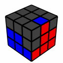
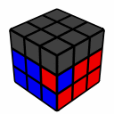
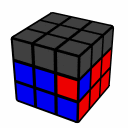

---
title: "ステップ３＋　中段のアンラッキーパターンの対応"
date: "2015-02-10"
order: 10
---
[初級編のステップ３](#)では、中段を揃える方法を覚えました。

このように中段のパーツが上にあるときに、これを揃えることができるようになったと思います。

ただ、上の場合のように位置は合っているが向きが違うという場合は、手順を２回こなさなければならず面倒でした。

このステップでは、**この場合の処理を簡単にする**方法を覚えます。

| **3+-1** |  | R U2 R' U R U2 R' U y L' U' L |
| --- | --- | --- |

「R U2 R' U」を2回やった後に持ち替えて直す、というイメージだと覚えやすいかも？

このステップはこれだけです。  
どんどんいきましょう。

[このページの最上部に戻る](#)  
[ステップ２＋へ進む](../step2plus)
