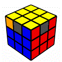

---
title: "ステップ６＋ ３層目のコーナーを1Lookで揃える"
date: "2015-02-10"
order: 9
---
[初級編のステップ６](#)では、３層目のコーナーを揃える手順を覚えました。

このようにコーナーにペアが１つだけできている時、ペアをL面に持ってきた状態で  
**「R U R’ U’ R’ F R2 U’ R’ U’ R U R’ F’」**  
とすることによってコーナーを揃えることができたのでした。

しかしペアが１つもできていない場合は、手順を２回こなさないといけない、いわゆる2Lookの状態でした。

このステップでは、ペアが１つもできていない状態から1Lookで３層目のコーナーを揃える手順を覚えます。  
これにより、**どんな状態からでも1Lookで3層目のコーナーを揃えることができる**ようになります。

| **6+-2** |  | F R U' R' U' R U R' F' - R U R' U' R' F R F' |
| --- | --- | --- |

ちょっと長いですが回しやすいので、すぐ覚えられると思います。

この手順をこなす時、**場所はどこでもOK**です。ペアが一つもないとわかった時点で、その場で手順をこなして下さい。

このステップで新たに覚えるのはこの1個だけです。覚えたら次にいきましょう。

[このページの最上部に戻る](#)  
[ステップ３＋へ進む](../step3plus)
