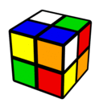
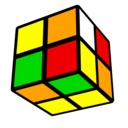
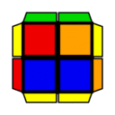

---
title: "EG-1・EG-2"
date: "2018-04-18"
order: 0
---
このページでは、EG-1のコツ・EG-2の概要について説明しています。

判断方法などの基本的なことは、[CLL・AntiCLL](/speedcubing/2x2x2/cll/)のページをご覧ください。  
また、個々の手順はあまり載せません。**手順一覧はこれを見てください！  
[Cyotheking](http://www.cyotheking.com/cll2-1/)  
[AlgDb](http://algdb.net/puzzle/222)**

### ペア位置の調整

EG-1は原則として、開始時に不完全1面のペアがB面にある状態にする必要があります。  
その際、1面を揃えたあとにDやy持ち替えを使ってペアをB面に持っていくよりも、1面が完成した時点でペアがBに来るような持ち方・回し方をした方がよいのは言うまでもありません。  
そのため、単に1面を作るよりも高度なテクニックが要求されます。

簡単な例を挙げてみましょう。

**Scramble: U F' U' F2 U' F U2 R' U2**(白U、緑F)  
  
黄色の1面が2手で作れます。何も考えずに作るのであれば**y U' L**、回しやすさを考えると**y' U' R**といったところでしょうか。  
ですが、B面にペアを持っていくことを考えると、このケースでの最適解は**y z' R' F**となります。  
実際に回して確かめてみてください。

2x2は持つ向きを変えることで、同じ1面でも何通りもの回し方を考えることができます。この際、[小ネタ集](/speedcubing/2x2x2/varasano-tips-sub5/)で挙げたような定石ばかりにこだわってしまうと、最適な回し方ができないことがあります。  
定石にこだわらず、ペアをB面に持っていく1面の作り方ができないか、いろいろ柔軟に試してみてください。

### EG-1の原理

EG-1の手順は、下の段を直しつつ上段も揃える手順なので、パッと見だとかなり不思議なことをやっています。しかし、理屈としては[OLLの仕組み](/how-to-solve/advanced/principlesofoll/)での説明と大きくは変わりません。

こちらも例を挙げてみます。  
  
これは最も簡単なEG-1の手順で、**R U' R2 F R2 U' R'**で揃えることができます。  
この手順を分解してみると、  
**①R U' R'** → 右前のコーナーを出す  
**②R' F R (もしくはL' U L)**→ 出したコーナーを左前に入れる  
**③R U' R'** → 左前から出てきたコーナーを右前に入れる  
となっており、「右のコーナーを左に入れ、左のコーナーを右に入れる」という非常に単純なことをやっていることがわかります。  
すべてのEG-1がこれで説明できるわけではありませんが、知っておくと手順を覚えるのに役立つ……かもしれません。

### EG-2について

EG-2は、D面が対角交換の不完全1面だった際に、それを修正しつつ残りを全て揃える解法です。  
やっている事はAntiCLLと変わりませんが、専用の手順を覚えることによりさらなる最適化を目指します。

2秒台前半や1秒台を狙っていくつもりの方、もしくはCLLもEG-1もコンプしたけどもっと手順を覚えたいという物好きな方は覚えていくとよいと思います。  
それ以外の方はAntiCLLで十分だと思います。まあ気が向いたらどうぞ。  
**[Cyotheking](http://www.cyotheking.com/cll2/)　[AlgDb](http://algdb.net/puzzle/222)**

（2018/04/18 執筆者：HATAMURA）

[**2x2x2　トップへ戻る**](/speedcubing/2x2x2/)
