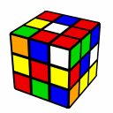
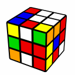
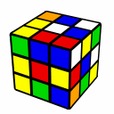

---
title: "3x3x3目隠し　ソルブ実例集"
date: "2016-02-11"
order: 0
---
このページでは、実際に3x3目隠しをどのように解いているのか説明しています。  
実際の回転記号も全て載せていますので、やり方を理解していなくても大丈夫です！  
実例から考え方を学んでいきましょう！

### 注意

・**スクランブルは「自分の基準面と同じ持ち方」で**行ってください。

・**このページでの基準面は「U面が白、F面が赤」**です。基準面が違う場合は、自分の基準面に応じて画像を読み替えてください。

・解法は、すべて**「エッジ：M2法、コーナー：Old Pochmann法」**で行っています。

・このページでは、**「なぜそうするのか」「なぜそうなるのか」についてはほとんど説明していません。**勿論ちゃんとした理屈はありますが、いちいち説明しているととても長くなるので、とりあえず「これはこういうものだ」とだけ書くようにしています。**理論をちゃんと理解していなくても目隠しソルブ自体は可能です。**

### ソルブ実例その１

**スクランブル：B' U2 R2 D2 F2 L2 R' F' L' R' D' R' F2 U' R2 U L' B' D**  

**エッジ分析：**  
(DF>)UL>DL>RU>LF>BD>LB>BU>BR>FU>RF(>FD)  
EO:DR  
パリティ無

**コーナー分析：**  
(UBL>)FDR>RDB>DLB>RUB>RUF>LUF(>UBL)  
CO:なし

**記憶するもの：**  
エッジ：えれさみつめたてかせ  
パリティ無  
EO:DR  
コーナー：くすれしさみ

**実際の手順：**  
エッジ  
え：L U’ L’ U M2 U’ L U L’  
れ：U’ L2 U M2 U’ L2 U  
さ：B’ R B M2 B’ R’ B  
み：B L2 B’ M2 B L2 B’  
つ：M2 F R U R’ E R U’ R’ E’ F’  
め：L’ B L B’ M2 B L’ B’ L  
た：F2 \[M’ U M’ U M’ U2 M U M U M U2\] F2 M2  
て：U R’ U’ M2 U R U’  
か：F E R U R’ E’ R U’ R’ F’ M2  
せ：B’ R2 B M2 B’ R2 B  
EO：R2 U x \[M’ U M’ U M’ U2 M U M U M U2\] x' U' R2

コーナー  
く：R F \[ R U’ R’ U’ R U R’ F’ R U R’ U’ R’ F R \] F' R'  
す：R \[ R U’ R’ U’ R U R’ F’ R U R’ U’ R’ F R \] R'  
れ：D F' \[ R U’ R’ U’ R U R’ F’ R U R’ U’ R’ F R \] F D'  
し：R2 \[ R U’ R’ U’ R U R’ F’ R U R’ U’ R’ F R \] R2  
さ：R' \[ R U’ R’ U’ R U R’ F’ R U R’ U’ R’ F R \] R  
み：F2 \[ R U’ R’ U’ R U R’ F’ R U R’ U’ R’ F R \] F2

**・ポイント**  
特殊な処理の少ないわかりやすい例です。  
基本となる事項を押さえておきましょう。

**①バッファから順にパーツを辿り、バッファに戻ってくるまで続ける**  
交換の基点となるバッファ（エッジはDF、コーナーはUBL）からスタートしてパーツの移動を辿っていきます。そして、出てきたパーツの文字を順番に覚えていきましょう。これをバッファに戻ってくるまで続けます。このパーツの移動の一連の流れのことを**「ループ」**といいます。

**②バッファの違う位置に戻ってくる場合**  
今回のエッジでは、DFから初めていくとFDにたどり着きます。DFとFDはステッカーは違いますがパーツとしては同じなので、これでバッファに戻ってきたことになります。  
ちなみに、こういうループのことを**「ねじれループ」**といいます。

**③バッファは記憶しなくてよい**  
最初と最後にバッファが出てきますが、バッファの文字列は記憶しなくてOKです。バッファは毎回必ず同じなので、覚える必要がないからです。今回の場合で言えば、エッジは「**ら**えれさみつめたてかせ**く**」ではなく「えれさみつめたてかせ」と覚えることになります。

**④覚えた文字列に対応する手順を回していく**  
それぞれの文字に応じて手順を回していきます。覚えた文字と手順は1対1に対応しているので、覚える文字が決まれば揃え方も自動的に決まってきます。

**⑤EOがある場合**  
EOが起こった場所（今回はDR）を覚えておきます。これについては決まった覚え方はないので、好きな方法で覚えておきましょう。  
そして、**EOはかならず偶数個同時に起こります。**これはルービックキューブの性質上必ず決まっていることです。  
分析の時EOが奇数個の場合は、エッジ終了時点でバッファにEOが残るようになります。  
今回の場合、「うぬとけせさたそくて」が終わった時点でキューブを見てみると、DFのエッジが反転した状態で残っていることがわかると思います。このDFとDRの二つで、EOを処理します。セットアップや持ち替えを利用して、専用手順が使える位置に移動させて処理します。

### ソルブ実例その２

**スクランブル：U F2 D2 B2 F2 D' F L' U2 R U' B' L' D' B2 U' F' D2 F2**  

**エッジ分析：**  
(DF>)LU>DR>RF(>DF)  
FL>LB>BD>BR>LF  
UR>UB>UR  
パリティ有  
EO:UF

**コーナー分析：**  
(UBL>)FLU>DFR>LDF>RDB>URB>UFR>DLB(>UBL)  
CO:なし

**記憶するもの：**  
エッジ：まりせけめつてみいあい　もしくは　まりせけめかてみいあい  
パリティ有  
EO:UF,DL  
コーナー：かりむすいうれ

**実際の手順：**  
エッジ  
ま：B L’ B’ M2 B L B’  
り：U R2 U’ M2 U R2 U’  
せ：B’ R2 B M2 B’ R2 B  
け：U’ L’ U M2 U’ L U  
め：L’ B L B’ M2 B L’ B’ L  
か：F E R U R’ E’ R U’ R’ F’ M2  
て：U R’ U’ M2 U R U’  
み：B L2 B’ M2 B L2 B’  
い：R’ U R U’ M2 U R’ U’ R  
あ：M2  
い：R’ U R U’ M2 U R’ U’ R  
パリティ：D' L2 D M2 D' L2 D  
EO：x \[M’ U M’ U M’ U2 M U  
M U M U2\] x'

コーナー  
か：F' D \[ R U’ R’ U’ R U R’ F’ R U R’ U’ R’ F R \] D' F  
り：D' F'\[ R U’ R’ U’ R U R’ F’ R U R’ U’ R’ F R \] F D  
む：F2 R'\[ R U’ R’ U’ R U R’ F’ R U R’ U’ R’ F R \] R F2  
す：R \[ R U’ R’ U’ R U R’ F’ R U R’ U’ R’ F R \] R'  
い：R D'\[ R U’ R’ U’ R U R’ F’ R U R’ U’ R’ F R \] D R'  
う：F \[ R U’ R’ U’ R U R’ F’ R U R’ U’ R’ F R \] F'  
れ：D F' \[ R U’ R’ U’ R U R’ F’ R U R’ U’ R’ F R \] F D'

**ポイント：**  
このソルブにはいくつかの注意すべき点があります。

**①ループが切れたときの対応**  
DFから始まるループがパーツ4つで終わっており、まだ分析していない箇所が残っています。  
こういう時は、**まだ分析していない場所から分析を再開**します。今回の場合はFL「け」から再開しています。  
そして、エッジはDFから始まるループでは最初と終わりのDF（FD）は記憶しないでよいのですが、**DF以外から始まるループの場合は最初と最後の文字を必ず記憶しなければなりません。**なので最初の「け」を記憶の文字列に含めます。さらに……

**②ループの終わりが最初と違う場合**  
さらに今回は、FL「け」から始まったループがLF「み」で終わっており、ねじれループになっています。  
この場合、最後に「け」ではなく「み」を加えて**「けめつてみ」と覚えます。**

さらに、もうひとつ「UR>UB>UR」のループがあります。こちらはねじれループではありません。こちらは**「いあい」**と覚えます。  
このような場合同じ文字が2回出てきますが問題ありません。

また、ループが切れている場合に共通して言えることですが、**記憶するときにループの切れ目を覚えておく必要はありません。**  
今回で言えば、「まりせ／けめつてみ／いあい」という風に、ループがどこで切れているかを記憶に含める必要はないということです。  
一続きの文字列として「まりせけめつてみいあい」と覚えてしまえばOKです。

**③「う」と「る」、「か」と「つ」**  
これらの文字が偶数番目にくる場合は、それぞれ対になる手順を回す必要があります。詳しくは[M2法解説](/speedcubing/3x3x3bld/m2-method/)を見てください。  
今回の場合だと、**6番目にBD「つ」が来ています。このときはFU「か」の手順を回さないといけません。**

こういう場合の分析・記憶・実行の仕方は2通りあります。  
一つ目は、**分析はそのまま「つ」と覚えておき、揃えている途中に偶数か奇数かを判断して「か」の手順を回す**という方法です。  
分析は楽ですが、揃えるときが少し面倒で間違えやすいです。

二つ目は、**分析の段階で偶数か奇数かを判断して「か」と覚えておき、揃えるときはそのまま「か」の手順を回す**という方法です。  
揃えるのは楽ですが、分析の時が面倒になります。

**④UF,BD,UB,ULにEOがあり、さらにパリティもある場合**  
これらの場合は、パリティとEOの処理の順番や位置をよくよく考える必要があります。  
今回の場合はUFにEOがあるのですが、エッジ終了直後だとパリティがあるためEOすべきパーツがBDに移動しています。  
この場合は**先にパリティ処理をしてエッジを移動させてからEOをこなす**必要があります。（パリティ処理をする前に、BDにある状態でEOを処理してしまうという方法もあります）  
この場合の処理方法は人によってさまざまです（ソルブのいちばん最初にEOを処理してしまう人、パリティやEOの位置に応じて順番を適宜入れ替える人、エッジとコーナーが全て終わったあとにEOやCOを処理する人など）。**自分にとって分かりやすいなと思う方法を、あらかじめ決めておくとよい**でしょう。

### ソルブ実例その３

**スクランブル：D' F2 D L2 D' L2 R' F' L F' R' B2 F' L2 D B2 U2 L D2**  

**エッジ分析：**  
(DF>)UL>DL>RU>DR>FL>DB>BL>UB>RB>UF>FR(>DF)  
EO:なし  
パリティ有

**コーナー分析：**  
URB>UFL>DFL>FDR>RDB>DLB>RUB  
CO:UFR 左回転

**記憶するもの：**  
エッジ：えれさりけるちあしうき　または　えれさりけうちあしるき  
パリティ有  
EO:なし  
コーナー：いえらくすれし  
CO:UFR 左回転

**実際の手順：**  
エッジ  
え：L U’ L’ U M2 U’ L U L’  
れ：U’ L2 U M2 U’ L2 U  
さ：B’ R B M2 B’ R’ B  
り：U R2 U’ M2 U R2 U’  
け：U’ L’ U M2 U’ L U  
う：U2 M’ U2 M’  
ち：U’ L U M2 U’ L’ U  
あ：M2  
し：R B’ R’ B M2 B’ R B R’  
る：M U2 M U2  
き：U R U’ M2 U R’ U’  
パリティ：D' L2 D M2 D' L2 D

コーナー  
い：R D' \[ R U’ R’ U’ R U R’ F’ R U R’ U’ R’ F R \] D R'  
え：F R' \[ R U’ R’ U’ R U R’ F’ R U R’ U’ R’ F R \] R F'  
ら：F' \[ R U’ R’ U’ R U R’ F’ R U R’ U’ R’ F R \] F  
く：R F \[ R U’ R’ U’ R U R’ F’ R U R’ U’ R’ F R \] F' R'  
す：R \[ R U’ R’ U’ R U R’ F’ R U R’ U’ R’ F R \] R'  
れ：D F' \[ R U’ R’ U’ R U R’ F’ R U R’ U’ R’ F R \] F D'  
し：R2 \[ R U’ R’ U’ R U R’ F’ R U R’ U’ R’ F R \] R2  
CO：B' \[ R U2 R' U' R U' R' L' U2 L U L' U L \] B

**ポイント：**  
いくつか特殊な処理があります。順番に説明していきます。

**①「う」と「る」、「か」と「つ」**  
今回の場合だと、6番目にDB「る」、10番目にUF「う」が来ています。このときはそれぞれ「う」「る」の手順を回さないといけません。

**②パリティ処理**  
実例２ではちゃんと説明しなかったので、ここで改めて説明します。  
**エッジとコーナーの文字数の偶奇は必ず一致します。**これはルービックキューブの性質上必ず決まっていることです。もし偶奇が一致しなければ分析がどこかで間違っています。  
さらに、**それぞれの文字数が奇数の場合はパリティ処理が必要になります。**  
パリティ処理は、必ず**エッジがすべて終了した後に行ってください。**順番を間違えると正しく揃わなくなります。

**③バッファがすでに揃っている（もしくはCO、EOしている）場合**  
この場合は、**ループが切れている場合と同じように考えてください。**まだ分析していない、他のパーツから始めます。今回はURBから始めています。  
また、**バッファのCOやEOは覚える必要がありません。**今回の場合では、COはURFだけ覚えればOKです。

**④COの処理**  
基本的なことはEOと同じです。ただし、**COには左回転、右回転の2種類がある**ことに注意してください。  
覚え方ですが、今回の場合だと「左回転で揃える」と覚えてもいいですし、「右回転している」と覚えても構いません。まあ覚えられればなんでもOKです。  
そして、COも専用手順とセットアップを駆使してうまく揃えましょう。

ちなみに、COを2文字のループと捉えて、Old PochmannでCOを処理することもできます。  
今回の場合だと、最後に「うき」の2文字を追加して処理すれば、COの処理になります。  
「CO手順がどうしても覚えられない！」という方におすすめです。

(2022年11月16日 加筆修正：[うえしゅう](/author#uesyuu)）
