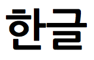
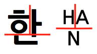
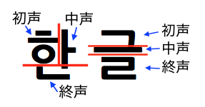
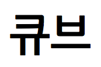
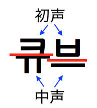

---
title: "ハングル記憶法"
date: "2016-04-30"
order: 0
---
「ハングル」は韓国の公式文字です。  
1443年、国家プロジェクトとして作られた表音文字で、構造的です。  
この構造を利用したBLDの記憶法が「ハングル記憶法」です。  
もちろん韓国語が出来ないと使えないので、興味本位で読んでください(笑)。

### ハングルの構造

まずはハングルの構造について説明します。ハングルが分かる方はパスしても構いません。  

これがハングルの例です。  
ハングルは1文字で1音節を表わし、だいたい四角い形をしています。漢字の影響を受けたと言われています。

例では、「한」が1文字、「글」が1文字です。  
合わせて2文字ですから2音節の単語ですね。  
なんと読むかというと(アルファベットで適当に書きますが)、\[han gul\] です。  
そうです。ハングルです。

ハングルの1文字は「字母」と言われる部品で構成されています。  
字母には子音と母音があって、基本字母は子音が14個(ㄱㄴㄷㄹㅁㅂㅅㅇㅈㅊㅋㅌㅍㅎ)、母音が10個(ㅏㅑㅓㅕㅗㅛㅜㅠㅡㅣ)です。  
1文字が1音節なので基本的に「子音＋母音＋子音」になります。字母は文字ではありませんが、アルファベットみたいなものだと思っても構いません。  
ㅎ(子音)+ㅏ(母音)+ㄴ(子音) = H(子音)+A(母音)+N(子音)的な感じです。  

最初の子音を「初声」、間の母音を「中声」、最後の子音を「終声」を呼びます。  
上か左上の方が初声、下の方が終声、その間が中声です。  
図で表わすと、こんな感じです。  

初声と中声は必ずありますが、終声は無い場合もあります。  
例えば  
  
これは \[kyu bu\] と読みます。はい、キューブですね。  

これくらい知っておけば十分でしょう。では本題に入ります。

### エッジのハングル記憶法

初声でパーツの位置を、終声の有無で向きを表わします。

例えば、UBが「ㄱ\[g\](子音)+中声(母音)」ならBUは「ㄱ＋中声＋終声(子音)」で、  
FRが「ㅎ\[h\]+中声」ならRFは「ㅎ+中声＋終声」です。

普通は2つのパーツをペアとして2文字の単語を作ります。  
初声は固定ですが、中声も終声も色々あって自由度が効くので、簡単に単語を思い付くことが出来ます。  
(基本字母だけで考えると、理論上1文字当たり終声無しが10通り、終声有りが140通りになります。2文字なら最低100通りから最大19600通りですね。あくまでも理論上ですが(笑)。)

上の例に従うと、UB FR なら 「ㄱ\[g\]+母音」に「ㅎ\[h\]+母音+子音」ですね。  
고향\[go hyang\]：故郷  
가훈\[ga hun\]：家訓  
계획\[gye hweg\]：計画  
구혼\[gu hon\]：求婚  
など、たくさん作れます。

このように、1パーツで1文字なのに意味を持った文字列になるというのが、ハングル記憶法のメリットです。

### コーナーのハングル記憶法

エッジと同じく初声でパーツの位置を表わしますが、コーナーは向きが3通りなので、中声を「横母音」と「縦母音」の2つに分けます。  
横母音は横長い母音(ㅗ ㅛ ㅜ ㅠ ㅡ など)、縦母音は縦長い母音(ㅏ ㅑ ㅓ ㅕ ㅣ など)です  
(ちなみに横母音、縦母音は言語学用語でも何でもなく、便宜上の区分です）。  
横母音(終声無し)・縦母音(終声無し)・終声有り、この3つで向きを区別します。

例えば、UBRが「ㄷ\[d\]+横母音」なら、BRUは「ㄷ+縦母音」で、RUBは「ㄷ+母音(なんでも)＋子音」という具合です。

エッジほどの自由度はありませんが、単語を作るには問題ありません。

上の例にBLDが「ㅁ\[m\]+横母音」で、LDBが「ㅁ+縦母音」DBLが「ㅁ+母音+子音」だとして単語を作ってみると、

BRU DBLなら、「ㄷ\[d\]+縦母音」「ㅁ\[m\]+母音+子音」で  
다만\[da man\]：ただ  
다면\[da myon\]：多面  
LDB UBRなら、「ㅁ+縦母音」「ㄷ+横母音」で  
머드\[mo du\]：マッド(泥の方)  
미드\[mi du\]：アメリカのドラマ(の略)  
などがあります。

### おわりに

これで終わりですが、面白かったでしょうか。  
時間の無駄ではなかったと思ってくだされば幸いです。

（2016/04/30　文責：[のりじ](../../../author/#norizi)）
