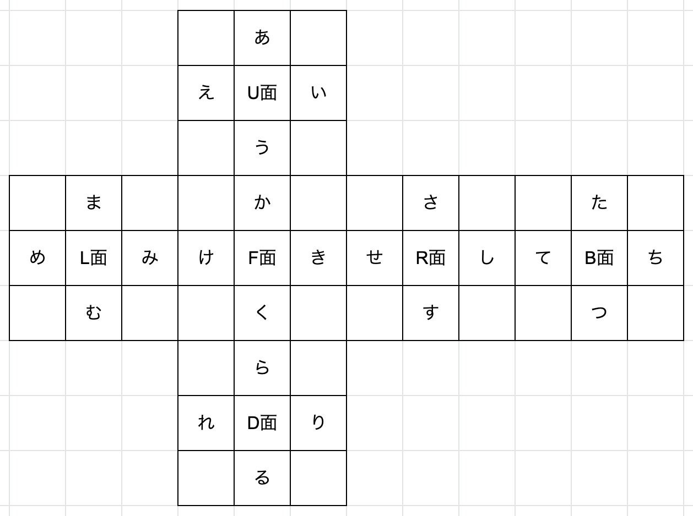
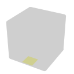
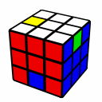
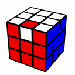
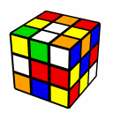
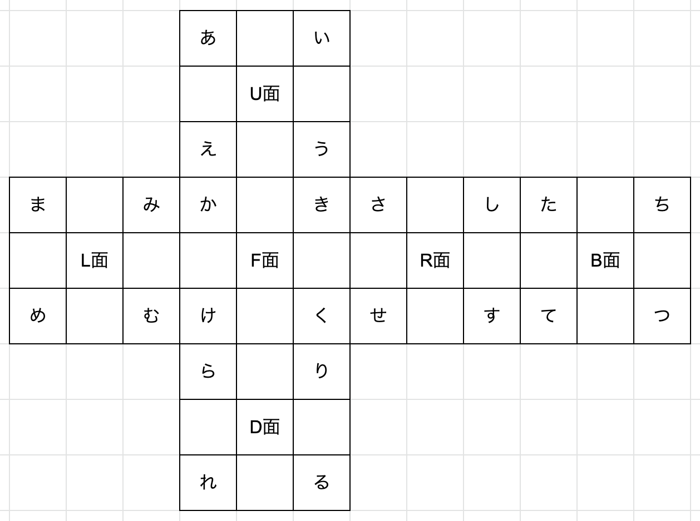
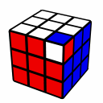
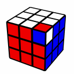

---
title: "ステッカー記憶（分析）のやり方"
date: "2015-03-09"
order: 0
---
M2法やOld Pochmann法などの解法では、ステッカーの移動を覚える「ステッカー記憶」という方法で分析、記憶を行います。  
BLDを学びたい方は、まずこれを理解してから解法を学ぶようにしてください。

また、このサイトではU面を白、F面を赤にしてBLDを行っています。  
BLDではキューブの向きがとても重要になるので、必ずこの通りに持って実行してください。

スクランブルについては、U面を白、F面を緑にして行ってください。

### エッジ編

・準備  
まずエッジのステッカー1つ1つにナンバリング(文字を振ること)をします。

今後はこのナンバリングで説明していきます。

次に、分析の基準にするステッカーの場所を決め、そこからのステッカーの移動場所を記憶します。  
ここでは、M2法に従ってDFエッジを基準の場所にします。  
DFエッジとは、D面とF面の境にあるエッジのD面のステッカーを指します。  
ナンバリングでいうと「ら」の場所です。  

この場所です（見にくい・・・）  
最初の文字がステッカーの場所を指します。  
今後はこの表記を多用しますので、今のうちに覚えておいて下さい。

例:スクランブル:D' U2 M' U2 M D  

DFエッジにあるステッカーはURエッジにあるべきものです。  
URエッジは「い」のナンバリングをされているので、「い」と記憶します。  
次に、そのURエッジにあるステッカーはULエッジにあるべきものです。  
ULエッジは「え」のナンバリングをされているので、「え」と記憶します。  
次に、そのULエッジにあるステッカーはDFエッジにあるべきものです。  
DFエッジは最初に設定した基準のステッカーなので、ここでループは終了します。  
これらを最初から合わせると、「いえ」と記憶すれば良いことになります。

・注意  
分析の途中でFDエッジに行き着く事があります。  
しかしFDエッジは基準面DFエッジと同じパーツにあるため、この時点でループは終了します。

・新しくループを作る  
ループが終了したがまだパーツが全て揃わない場合、または最初から基準面のDFエッジが揃っている場合、新しくループを作る必要があります。  
その場合、今まで記憶してこなかったパーツを探して、そのパーツのステッカー(2つのうちのどちらでも良い)からループを作り始めます。  
ここで注意すべき事があります。  
新しいループの分析の途中で必ず、ループの作り始めのパーツに行き着きます。  
この時点でループは終了しますが、終了した時点で分析しているステッカーの文字も覚えなくてはなりません。  
つまり、ループの作り始めのパーツに関しては、最初と最後の計2回覚える必要があります。

・単独エッジ反転(EO)  
エッジパーツのいずれかが単独で反転している場合がありますが、これは実行を行った後に別に処理をするため、そのパーツの位置を覚えておいて下さい。  

例えばこのような形

・例題  
最後に記憶（分析）の例をあげます。  
スクランブル：F2 D2 F L2 D2 B' D2 F D2 U' F' L' R2 B2 U B' L' F U  
  
（U面を白、F面を緑にしてスクランブルしてください。U面が白、F面が赤（基準面）に持ち替えてからスタートします）

分析結果：てみためせいるかまむさ、DRエッジがEO  
解説：  
まずDFエッジから順番に追っていくと、「てみためせ」でDFエッジが元の場所に戻り、ループが終了します。  
次に、まだ分析されていないURエッジの「い」から新しく分析を始めていきます。  
そうすると、「いるかまむさ」でURエッジが元の場所に戻り、ループが終了します。  
ここで、最初の文字「い」と最後の文字「さ」が違うことに違和感を持たれるかもしれませんが、「い」と「さ」はどちらもURエッジ上のステッカーであるため、ちゃんと同じ場所に戻ってきていることがわかります。  
最後に、DRエッジが単独でEOしていることを覚えれば、分析終了です。

### コーナー編

・準備  
まずコーナーのステッカー1つ1つにナンバリングをします。

次に、分析の基準にするステッカーの場所を決め、そこからのステッカーの移動場所を記憶します。  
ここでは、Old Pochmann法に従ってULBコーナーを基準の場所にします。  
ULBコーナーとは、U面とL面とB面の境にあるコーナーのU面のステッカーを指します。  
ナンバリングでいうと「あ」の場所です。

この後のループの作り方などは、エッジの時と全く同じなので割愛します。  
ただし、単独エッジ反転(EO)の代わりに起こる単独コーナー回転(CO)は、向きが2パターンあるため、覚える際に注意が必要です。  

URFコーナーであれば、この2パターンが存在します。

・例題  
最後に記憶（分析）の例をあげます。  
スクランブル：F2 D2 F L2 D2 B' D2 F D2 U' F' L' R2 B2 U B' L' F U  
先ほどと同じスクランブルです。  
（U面を白、F面を緑にしてスクランブルしてください。U面が白、F面が赤（基準面）に持ち替えてからスタートします）  

分析結果：けてかれうたう、DRFコーナーがF面向きのCO  
解説：  
まずULBコーナーから順番に追っていくと、「けてかれ」でULBコーナーが元の場所に戻り、ループが終了します。  
次に、まだ分析されていないURFコーナーの「う」から新しく分析を始めていきます。  
そうすると、「うたう」でURFコーナーが元の場所に戻り、ループが終了します。  
最後に、DRFコーナーが単独でF面向きのCOしていることを覚えれば、分析終了です。（向きに注意！）

(2013年5月7日 執筆者：[うえしゅう](../../../author#uesyuu)）  
(2022年11月16日 加筆修正：[うえしゅう](../../../author#uesyuu))

[このページの最上部に戻る](#)  
[3x3x3目隠しトップに戻る](../)
