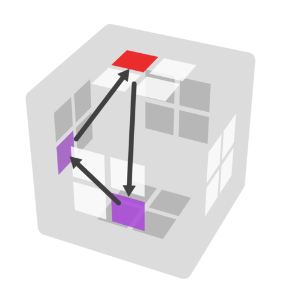
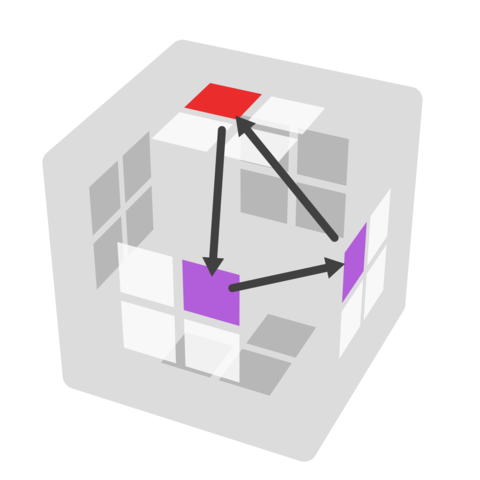
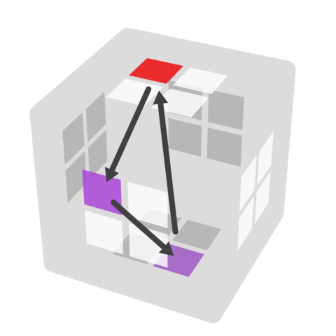
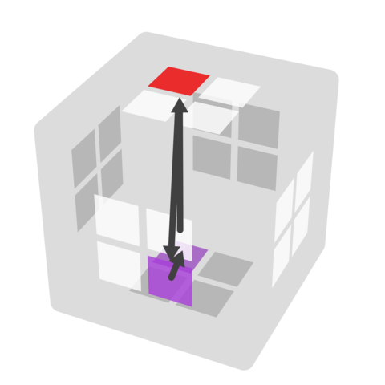
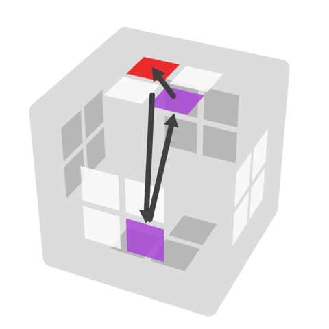
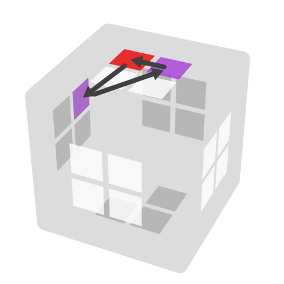
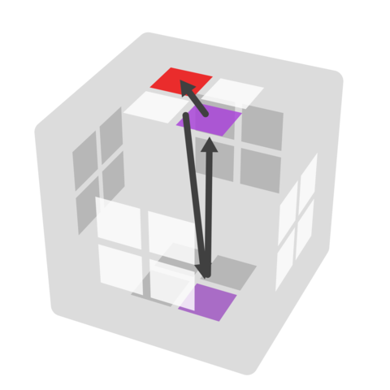
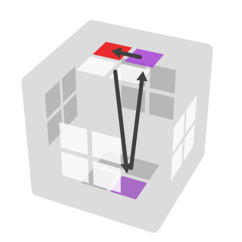

---
title: "4BLDセンターの3cycle解法 入門（Y.Yさんからの寄稿）"
date: "2018-03-27"
order: 0
---
ここでは、自分が4×4×4目隠し競技(4BLD)を始めた際に苦労した部分の一つであるセンターコミュテータについて解説していきます。そもそも4BLDの解き方がわからないという場合は[4BLD入門](/speedcubing/45mbld/yy-4bldbeginner/)を見て下さい。  
先程のサイトにも書いてある通り、初学者におすすめのセンター解法は【U2法】というものです。これはM2法と同様に、2点交換の動き（U2法ではU2）を用いて1パーツずつ揃えていくもので、文字と手順が1対1に対応するのでとてもわかりやすいです。3BLDでも、まずは2点交換の解法を用いて分析や記憶・実行に慣れてから3点交換の解法に移行するというのが上達する上でのセオリーなので、4BLDを初めてやるという人はセンターもU2法から勉強するのがいいと思います。

ただ、センターの場合はコミュテータが簡単に作れる（他の面のセンターパーツに干渉せずセットアップを回すことが出来るから）ため、コーナーやエッジに比べコミュテータを導入するのは楽です。コミュテータに慣れている人はU2法を学ばずにいきなりセンターコミュテータから勉強することも可能だと思います（自分はそうしました）。  
とはいっても自由度が高く苦労する人もいると思うので、この記事ではセンターの配置によって4パターンに分類し、それぞれのケースでどう回せばいいかという考え方について解説しています。この記事を読み、理解すれば全ての手順を作り出せるようになるはずです。読んでみて作れそうだと思った人はぜひ試してみて下さい。

ちなみに、コーナーコミュテータのうち一部の回転を中列回しに変えることで、センターコミュテータの手順に流用することができるものもあります。とはいっても回すのが大変だったり手数がかかるものが多いため、センターはセンターで新たに考え直すのがいいと思いますし、わざわざコーナーコミュテータを勉強する必要はないです。ただ、コーナーコミュテータと同様の手順が回しやすい場合、例外的にそちらの手順を使うのはありだと思います（例：Ulb Fur Bdr:\[x:U'lU,r2\] これはULB FUR BDR:\[x:U'LU,R2\]のL,Rを中列回しに変えた手順で、回しやすいです）。

また、そもそもコミュテータがよくわからない方は、まずは[TRCCのサイト](http://trcc.sub.jp/solution/fmc/commutator.html "TRCCのサイト")をご覧ください。

では本題に入っていきます。

ここではバッファは**Ulb**（U面のセンターパーツのうちL,B面側にある物、という意味）に指定して解説しています。自分はコーナーバッファがULBであり、似た配置の方がいいと考えてセンターバッファをUlbにしました。ただ必ずしも合わせる必要はなく、U面であればどこでもやりやすいです。  
バッファがU面の場合、センターコミュテータは交換したい二つのステッカーの位置から**大きく4つに分類されます**。  
・[1\. 側面＋側面](#1)  
・[2\. 側面＋D面](#2)  
・[3\. U面＋側面](#3)  
・[4\. U面＋D面](#4)  
（ここでU面＋U面とかD面＋D面のパターンはないのか、と思われる方がいるかもしれませんが、結論から言うとありません。同じ面が2回連続で来ることがありえないからです。センターの分析の仕方を考えてみるとわかると思います。）

上から順に説明していきます。

### 1\. 側面＋側面

**例1-1）Ulb, Fdr, Ldf**  
  
dの動きでLdfがFdrに動くので、インターチェンジはdです。また、rU2r'の動きでUlbがFdrにインサートされます。  
よって、手順はrU2r' d rU2r' d' となります（これをインサート、インターチェンジのみ取り出して\[rU2r',d\]と書きます）。  
**例1-2) Ulb, Fur, Ruf**  
  
このままではコミュテータを行える位置関係ではないですが、RでRufをRubにセットアップします。そうするとuの動きでRubがFurへ移動し、またrUr'の動きでUlbがFurにインサートされるので、コミュテータを行えます。  
よって、手順は\[R:rUr', u\]となります。（ここで:の前の回転記号はセットアップを意味しています）

**【解説】**  
例1-1のように、U面を側面のいずれかのステッカーにインサートするのがこの場合のコミュテータの基本的な作り方です。  
さらに、例1-2のように側面を自由に動かしてセットアップすることで、二つのステッカーをインターチェンジ可能な関係に簡単に持ち込めます（上で述べた、センターコミュテータが習得しやすい理由です）。他の例としては、Ulb, Fdr, LubのパターンではL2でセットアップすることで例1-1のコミュテータに持ち込めます。  
以上をまとめると、側面＋側面ケースでコミュテータを作る際のステップは以下の通りになります。  
1\. 側面の二つのステッカーのうちU面パーツを3手でインサートできるステッカーを探す  
2\. もう一方のステッカーを、先程のステッカーとインターチェンジの関係になるようにセットアップする  
3\. ピュアコミュテータを実行する  
4\. 逆セットアップを行う

このやり方で探せばセットアップは1手で済みます。逆セットアップで間違えやすいので注意です。  
ただ、この方法では上手く行かないケースもあります。例えばUlb, Ful, Lubでは、Ful, Lub共にUlbを3手でインサートできません。この場合は、しょうがないですが最初にUもしくはU'で1手セットアップしましょう（3手インサートにUを加えた4手インサートと考えても可。こう考えた方が、更にセットアップが必要な場合に、セットアップ2手の順番を気にしなくて済むので楽だと思います。例えば、Ulb,Ful,Ldbについては\[L:Ul'U'l,u'\]とするのがいいと思います）。

### 2\. 側面＋D面

**例2-1）Ulb,Ful,Drf**  
  
l'でFulがUlbに動き、Ur2U'でDrfがUlbへインサートされます。よって手順は\[Ur2U', l'\]となります。  
**例2-2）Ulb,Fdr,Dlb**  
  
この場合はF2,D2でセットアップすることで上で説明した位置関係に持ち込めます。手順は\[F2D2:Ur2U',l'\]となります。詳しくは下で解説します。  
**【解説】**  
一応、このケースではどのパターンも1手セットアップでピュアコミュテータに持ち込むことが出来ます。ただ、パターンが膨大で煩雑で、また持ち替えが発生するケースもあり、さらにインサートとインターチェンジのどちらを先にすればいいかで混乱してしまうためとても面倒くさいです。  
なので、このケースは例2-1のようにDrfをUlbにインサートするコミュテータしか使わず、例2-2のようにどんな場合でもそのケースにセットアップするというようにあらかじめ決めておくのが一番わかりやすいと思います。要するに、側面のパーツがF面の場合ははFul、L面はLdb、B面はBdl、R面はRubにセットアップする、ということです。セットアップに2手かかることもありますが、その分単純でわかりやすいため、始めたばかりのうちはこのやり方を推奨しています。  
また、セットアップが2手の場合どちらを先に回したか忘れてしまうと、逆セットアップを間違えてしまいます。そのため、2手セットアップが必要な時は必ず側面を先に回す、と決めておくことでミスを減らせます（側面→D面→コミュテータ→D面→側面）。実際、例2-2ではセットアップはF2D2でもD2F2でも可能ですが、F2D2としています。

### 3\. U面＋側面

**例3-1）Ulb,Fdr,Ufr**  
  
\[l'd2l,U2\]  
**例3-2）Ulb,Lub,Ubr**  
  
\[y' F:l'u2l,U'\]

**【解説】**  
U2法から入った人にとっては一番わかりやすいパターンかもしれませんが、そうでない人は結構混乱する部分じゃないでしょうか。U2法でターゲットに側面のステッカーをセットアップする手順はここでのインサートに利用できます。  
自分が推奨しているのは、側面＋D面パターンと同様に、側面によってセットアップする箇所を決めておき（F面はFdr、L面はLuf、B面はBur、L面はLfr）、中列の180度回転を使って側面をUlb（バッファ）にインサートする手順です（F面の場合はl'd2l、L面の場合はl'u2l）。もちろん、ぱっと手順が思い浮かんだ場合はそちらを使えばいい（特にUlb、Ufrが絡むパターンでU2法で慣れている場合はそちらの手順を使った方がいいと思います）です。なかなか思いつかない時の最後の手段として、このような方法を決めておくと安定します。

### 4\. U面＋D面

**例4-1）Ulb,Drf,Urf**  
  
\[r2D'r2Dr2, U2\]  
**例4-2）Ulb,Drf,Urb**  
  
\[y D:r2D'r2Dr2, U\]

**【解説】**  
これもU2法を知っている人は分かりやすいかもしれません。U2法でも用いるr2D'r2Dr2という5手インサート手順（D面のパーツをU面のちょうど真上にインサートします）がとても便利なので、適宜U面もしくはD面をセットアップし、この手順を使って処理すればいいと思います。  
ちなみに、例4-2はピュアコミュテータで回すこともできます。コーナーコミュテータで慣れている人、コミュテータが得意な人はそちらを使った方が速いです。

ここまででセンターコミュテータについて一通り説明を終えたことになるので、4のセンターをコミュテータで解けるようになった……と言いたいところですが、もちろん実際はなかなか難しいです。そもそも考えるのに時間がかかるうえに、ミスも頻発すると思います。ミスりやすい部分としては、側面＋側面パターンでのインサートの2手目が90°か180°かの判別や、セットアップ・逆セットアップの回し間違いが多いでしょうか。これについては量をこなすして慣れていくしかないです。ちなみに自分はキューブを見ながらコミュテータを回す練習の他に、6文字くらいずつ分析した後見ないでコミュテータで実行するという練習をしていました。センターのパートのみで記憶・実行しタイムを記録するのもいいと思います。

（2018/03/27 執筆者：Y.Y）

**[4x4目隠し・5x5目隠し・複数目隠し　トップへ戻る](/speedcubing/45mbld/)**
