---
title: "4x4x4 基本的な揃え方"
date: "2015-03-09"
order: 0
---
### 4x4x4のパーツ名称

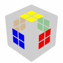センターパーツ

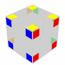コーナーパーツ

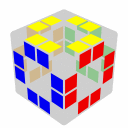エッジパーツ

### 揃えるときの考え方（アウトライン）

1.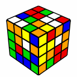スクランブル状態

2.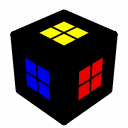(他のパーツは無視して)センターパーツを揃える

3.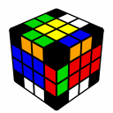エッジペアリング(ここまでの流れを「4x4x4の3x3x3化」と呼びます)

4.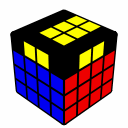4列を3列とみなしてF2L

5.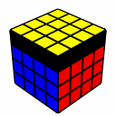パリティ解消(必要な場合)、OLL

6.パリティ解消(必要な場合)、PLL

### 4x4x4を解くのに必要な知識

3x3x3がLBLで解けることが大前提です。  
また、PLLの手順21種類をすべて知っているとパリティの有無が分かりやすいでしょう。  
あと、このページは回転記号を用いておりますので回転記号が読めるようにしてください。(回転記号表は[こちら](/how-to-solve/intermediate/notation/))

### パリティとは・なぜパリティが発生する？

パリティ(parity)とは数学・物理用語で「奇遇性」のことでキューブパズルにおいても多くの場所でこの言葉を聞くことになります(パズルを数学的に議論する時によく聞きます)。  
ここでは「3x3x3化したときに、通常の3x3x3ではあり得ない状態になっていること」を指します。  
例えば、  
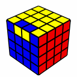や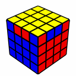

このような状態は(完成状態からスクランブルしただけの)3x3x3では発生せず、3x3x3の解法だけではこれ以上揃えることができません(画像のキューブは見えていない3面はすべて揃っています)。  
ところが3x3x3化した4x4x4ではこの状態が発生することがあります(発生しないこともあります)。  
なぜパリティが発生するのか？その理由を完全な初心者が分かるように説明することは困難です。いまは「偶数列の多分割キューブはパリティが発生する」と思ってください。  
パリティには大きく分けて2種類あり、それを解消する手順も2種類あるのですが、揃えるだけなら**手順を知らなくても、パリティが発生したらスクランブルする→再び解き直すをパリティが発生しないまで繰り返す**ことで揃えることができます。  
しかし、パリティが発生しない確率は25％と低め。あきらかに非効率ですし、タイムも安定しません。  
ぜひパリティ解消手順を覚えてください！(手順集は[こちら](../parity))

### センターパーツを揃える

センターパーツを揃える時に注意することは、完成状態と同じような位置関係になるように揃えなければならないということです。

ルービックキューブのセンターは位置関係が変わることはありません。  
ところが4x4x4では、誤った位置関係でセンターパーツを揃えることが出来てしまいます。  
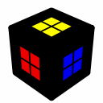※この画像はセンターの位置関係が誤っています！  
画像のキューブは赤と青のセンターパーツが入れ替わってしまっています。  
もちろんこの状態では完成することはありません。  
ここでは対色2面→側面→側面→ラスト2面の順で揃えますが、慣れるまでは黄→白→青→赤→残り2面の順で揃えましょう。

まずは1色のみ揃えます。  
揃えるときのコツですが、  
まず一面にセンターの2ペアをひとつ作り、  
それを崩さないようにしながら別の面にも2ペアを作り、  
4ペアを完成させる  
という流れがやりやすいです。  
この考え方はすべてのセンターで通用しますので、ぜひ物にしましょう。

以下の手順や、簡単な一層回転・二層回転を組み合わせて4ペアを作ってください。

| 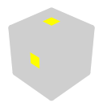→ | Rw |
| --- | --- |
| 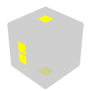→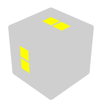 | Rw2 |
| → | Rw U Rw' |
| → | Rw' |
| 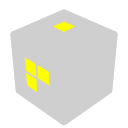→ | Rw U Rw' |

次にさっき揃えたセンターの反対側に、対色となるセンターを揃えます。  
これもさっきと同じように2ペアを2つ作ってから4ペアに持ち込むのが有用ですが、さらに注意してほしいのはさっき揃えたセンターを崩さないことです。

| → | Rw U' Rw' |
| --- | --- |
| → | Rw U' Rw' |
| → | Rw U2 Rw' |
| → | Rw U' Rw' |

続いて、3つ目のセンターをまだ揃えていない適当な面に揃えます。  
コツとしては揃えた対色2面をR面とL面にくるように持ち替え、Uw系及びDw系の回転をしないようにしてください。そうすれば揃えた2面が崩れることはありません。  
→  
上記した手順を組み合わせて揃えてください。

続いてさっき揃えた3面目の隣に4つ目のセンターを揃えます。  
ここで注意することは、3面目がD面にくるように持ち替え、すでに揃えた3面が崩れないようにすることです。  
また、冒頭でも説明したとおり、センターの位置関係には特に注意してください。  
画像のように黄→白→青の順に揃え、白＝R面、黄＝L面、青＝D面に持ってきた場合、次に揃えるべきは赤です。(海外配色の場合)  
→  
ここで使える手順は限られています。以下にその一部を紹介します。簡単な一層回転をしたり、手順の二層回転を二層180度回転に変えたりしてバリエーションを増やしてください！

| → | Rw' F' Rw F |
| --- | --- |
| → | Rw U2 Rw' |
| → | Rw U' Rw' |

最後に残った2面を揃えましょう。ここでは1面を揃えれば残りの1面も勝手に揃ってくれます。  
上記の4面目を揃える時の手順が有用です。  
→

### エッジペアリング

以下のエッジ3点交換を何回か繰り返すことで、センターを崩すことなくエッジペアリングが可能です。  
(画像の正面をF面としてください！)

エッジ3点交換(青・赤のエッジと黄・橙のエッジがペアリングされ、灰色のエッジも干渉されます)

| 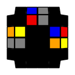 | u' R U' R' Uw |
| --- | --- |
| 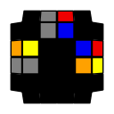 | u' F R' F' R Uw |
| 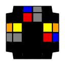 | R2 Dw2 F' L F L' Uw2 |
| 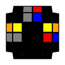 | R2 Dw2 L' U L Uw2 |

3点交換を繰り返していくと、最後に2つのエッジだけが残る場合があります(残らずにエッジペアリングが完了することもあります)。  
この場合は3点交換を繰り返しても完成しないので、以下の2点交換を使います。

|  | Uw' R U R' F R' F' R Uw |
| --- | --- |
|  | R2 Uw2 (u) R U R' F R' F' R Uw2 |

### 4列を3列とみなしてF2L

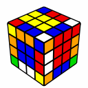→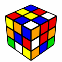  
タイトルの通り、3x3x3の要領でF2Lを行ってください。

### OLLパリティかどうか確認する

U面を見て、OLLパリティが発生しているかどうか確かめてください。  
簡単な判別方法があります。

  
正しい向きのエッジの数が1つor3つ＝**パリティが発生している**

  
正しい向きのエッジの数がないor2つor4つ＝**パリティが発生していない**

パリティ手順は[こちら](../parity)

パリティ解消をしたあと、OLLを行ってください。(U面が揃います)

### PLLパリティかどうか確認する

U面の側面を見て、PLLパリティが発生しているかどうか確かめてください。  
21種類あるPLLをすべて知っている場合は、**そのPLLにはない状態になっている＝パリティが発生している**と判断することができます。  
PLLを覚えていない場合は、一度コーナーOLLを揃えてから、パリティの有無を確認してください。

パリティ手順は[こちら](../parity)

パリティ解消をしたあと、PLLを行ってください。  
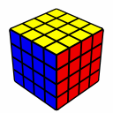

これで完成です！お疲れ様でした。

（執筆者：[Morooka](../../../author#morooka)）
