---
title: "5x5x5　ラスト２センター手順まとめ"
date: "2016-04-21"
order: 0
---
5x5x5のセンターの最後の2面を揃える際に便利な手順をまとめています。（全パターンではありません）  
手順の多くはラスト2センター以外にも応用できます。

※「t」は3層回しを表します。

| **1列目（中央列）** |
| --- | --- |
|  | Rw U R'w (U) R'w F Rw |
| [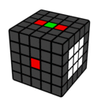](../../../assets/2016/04/fl2.gif) | M' U' M M' U M |
| [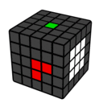](../../../assets/2016/04/fl3.gif) | R'w F Rw |
| **2列目** |  |
|  | L'w U2 Lw R'w F2 Rw |
| [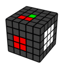](../../../assets/2016/04/sl5.gif) | Rw U' R'w |
| [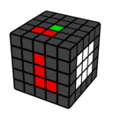](../../../assets/2016/04/sl6.gif) | Rw U' R'w |
| [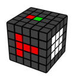](../../../assets/2016/04/sl1.gif) | Rt U' R't Rt U R't |
|  | Rw U R'w |
| [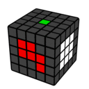](../../../assets/2016/04/sl4.gif) | R'w F' Rw L't U' Lt |
| **3列目（右列）** |  |
| [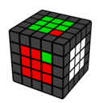](../../../assets/2016/04/000000001001000000.gif) | Rw U R'w U Rw U2 R'w |
| [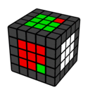](../../../assets/2016/04/001000000000000001.gif) | Rw U' R'w U' Rw U2 R'w |
|  | Rw U M' U' Rw' U M Rw U' M' U Rw' U' M |
|  | Rw U R'w |
| [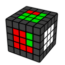](../../../assets/2016/04/110000000001001000.gif) | Rw U' R'w U Rw U R'w |
| [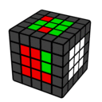](../../../assets/2016/04/100000010001001000.gif) | Rw U R'w U Rw U R'w |
|  | Rw U2 R'w U' Rw U'2 R'w |
| [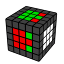](../../../assets/2016/04/001000001001000001.gif) | Rw U R'w U' Rw U R'w U' Rw U R'w |
| [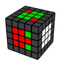](../../../assets/2016/04/100000001001000001.gif) | Rw U R'w U2 Rw U R'w (U) Rw U' R'w U2 Rw U' R'w |
|  | Rw U2 R'w |
|  | Rw U R'w U' Rw U2 R'w (U2) Rw U2 R'w U' Rw U R'w |
| [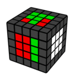](../../../assets/2016/04/000001101001001001.gif) | Rw U' R'w U Rw U' R'w |
|  | Rw U2 R'w U2 Rw U' R'w M' U2 M U Rw U2 R'w |
| **その他** |  |
| 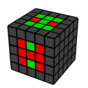 | M' U' M M' U M |
|  | Rw U M' U' Rt' |
| 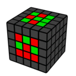 | Rw U R'w F Rw U R'w F Rw U R'w |
