---
title: "6x6x6　基本的な揃え方・コツ"
date: "2017-01-07"
order: 0
---
このページでは、6x6x6の基本的な揃え方や、タイムを縮めるためのコツについて書いています。

**※このページは4x4x4、5x5x5の解法を理解していることを前提で書かれています。ご了承ください。  
※このページ独自の回転記号として  
「2R」→「R面を2層回し」  
「3R」→「R面を3層回し」  
「4R」→「R面を4層回し」  
「3r」→「R面の3層目だけを回す」  
を使用しています。**

### はじめに・基本的な揃え方

　解法は基本的に5x5x5のオオクサ式と全く同じものです。  
　初めに6面のセンターを揃え、  
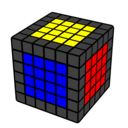  
次にエッジを全てペアリングし、  
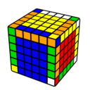  
最後に3x3x3の要領で揃える（必要に応じてパリティを処理する）  
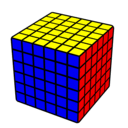  
という解法になっています。

　6x6x6は5x5x5とは違い偶数分割なので、  
・センターを揃える時、色の配置を間違えないようにしなければならない  
・OLLパリティやPLLパリティが発生することがある  
という点に注意が必要です。

### センター

　センターの揃え方はいろいろありますが、基本的な揃え方としてオススメしたいのは  
**「ラインを1本ずつ揃えていく」**  
というやり方です。  
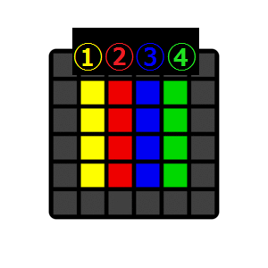  
　この図のようにセンターを4本のラインに分けてこれらを1つずつ揃えていくやり方が、分かりやすくオススメです。

　特に最初のうちは、**「②→①→③→④」の順に揃えていく**のをオススメします。  
　状況に応じて「②→③→①→④」や「①→②→③→④」などの順番にしたり、ラインではなくブロックを組むように揃えていくなど、臨機応変に対応できるようになればソルブの効率がよくなります。ただ、手数の少ない揃え方を考えているとかえって時間がかかってしまうこともありますので、特に最初のうちは無理に効率を上げようとするよりも、順番を固定してパーツを決め打ちで探していった方がタイムは縮めやすいと思います。

　それでは、1面ずつ揃えていきましょう。  
　最初の1面はどこでも構いません。インスペクション中に揃えやすそうな色を探しましょう。  
[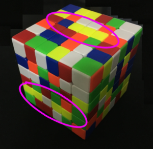](/speedcubing/6x6x6/6x6x6%e3%80%80%e5%9f%ba%e6%9c%ac%e7%9a%84%e3%81%aa%e6%8f%83%e3%81%88%e6%96%b9%e3%83%bb%e3%82%b3%e3%83%84/attachment/%e5%86%99%e7%9c%9f-2017-01-07-17-32-52/)  
　目安としては、この画像の黄色のセンター（ピンクで囲った部分）のように「パーツが３つ以上まっすぐ並んでいる箇所」がある色を探すとよいでしょう。

　1面が完成したら、次はその対面を揃えていきます。この時揃える色に注意してください。最初の1面で黄色を揃えたなら、次は白色を揃える必要があります。

　3面目は側面のどの色でも構いません。揃えやすそうな所から揃えていきます。そして3面目の隣から4面目、5面目と揃えていくとよいです。このあたりは5x5などと同じですね。ただし、この時も揃える色に注意してください。  
　また3面目以降で注意してほしい点として、**U面にセンターを作っていくのはなるべく避けてください。**U面は回しやすい面なので、まだ揃っていない面をU面に置いて揃えていくほうが回すのが楽になります。「今から揃える面」はなるべくD面やF面に置いて揃えていきましょう。

　最後の5面目を揃える際のコツですが、最初の図でいう「②→①→③→④」もしくは「①→②→③→④」の順番を必ず守って揃えてください。この順番で揃えれば、多少の工夫は必要ですが3列目までは必ずキレイに揃えることができます。最後の④列は、「端2つと真ん中1つを5x5x5と同じ要領で揃える」ようにすると、必ず「残り真ん中1パーツのみ」という状態に持っていくことができます。  
　……多分言葉では伝わりづらいと思います。最後にExample Solveを載せているので参考にしてください。

### センター手順のヒント

　センターを揃える際に覚えておくと便利な手順**の一例**を掲載しておきますので、参考にしてください。

| [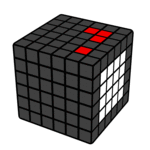](../../../assets/2017/01/6center7.gif) | **3r U' 3r'** |
| --- | --- |
| [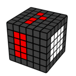](../../../assets/2017/01/6center5.gif) | **3r U 3r'** |
| [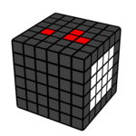](../../../assets/2017/01/6center6.gif) | **2R 2L' U 2R' 2L** |
| [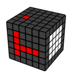](../../../assets/2017/01/6center1.gif) | **4R U 4R'** |
| [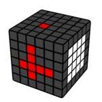](../../../assets/2017/01/6center2.gif) | **3l F' 3l'** |
|  | **3R U' 3R'** |
| [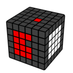](../../../assets/2017/01/6center4.gif) | **3r U 3r' U 3R U2 3R'** |
| [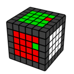](../../../assets/2017/01/6center8.gif) | **2R U 3r U' 2R' U 3r'** |
| [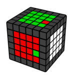](../../../assets/2017/01/6center9.gif) | **2R U' 3r U 2R' U' 3r'** |
| [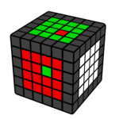](../../../assets/2017/01/6center10-1.gif) | **3r U 3r' U 3r U2 3r'** (U') 3r U' 3l' U 3r' U' 3l |
| [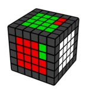](../../../assets/2017/01/6center11.gif) | **2R U' 3L' U 2R' U' 3L** |
|  | **2R U' 2L' 3r U 2R' U' 2L 3r'** |

### エッジ

　エッジパートは5x5とほとんど変わりません。中段を自由にずらして最初の8個を揃え、残り4つからは3点交換や「ずらす→エッジ反転→戻す」の動きを利用して揃えていきます。  
　ラスト2エッジの手順は4x4や5x5の手順も応用できるので、いろいろ工夫してみて下さい。

### 3x3x3パート

　普通の3x3と同じように揃えましょう。特にコツなどはありません……  
　OLLやPLLで2層回しや中段スライスを多用する手順など、3x3では使えるが多分割では使いづらいLL手順も多いです。そういった場合は、多分割専用の手順を覚えるのもいいかもしれません。  
**例：E-perm……R U R’ U R’ U’ R F’ R U R’ U’ R’ F R2 U’ R2 U R U’**

### パリティ

　6x6x6の3パートでは、4x4と同様OLLパリティやPLLパリティがありますが、これらは4x4と全く同じ手順で揃えることができます。6x6を「1列,2列,2列,1列」で分割すれば4x4と同じだと解釈できるからです。

　ちなみに、エッジパートの最後に画像のようなパリティ  
[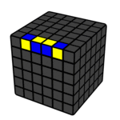](../../../assets/2017/01/6parity1.gif)  
が残った場合、これは3パートのOLLまで残しておいてください。  
　6x6は5x5と違い、OLLパリティが存在します。そのため、このエッジが  
[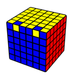](../../../assets/2017/01/6parity2.gif)  
このようなパリティなのか、それとも  
[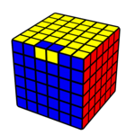](../../../assets/2017/01/6parity3.gif)  
このようなパリティなのかは、LLになるまで判断することができません。  
3パートの前にこれを処理してしまうと、後にOLLパリティをもう一度やる羽目になってしまう場合があります。そのため、このようなエッジが残った場合は、LLまで残しておくのが得策と言えます。  
　またこれをうまく利用するため、このエッジはなるべくLLのエッジに残しておくのがよいでしょう。

なお、前者のパターンは  
**2R U2 x 2R U2 2R U2 2R' U2 2L U2 4R' U2 2R U2 2R' U2 2R'** （5x5のパリティと同じ）  
後者のパターンは  
**3r U2 x 3r U2 3r U2 3r' U2 3l U2 3r' U2 3r U2 x' 3l' U2 3r'**  
で揃えられます。

### Example Solve

　何をやるか解説しながら揃えていく動画を作成しました。ぜひ参考にしてください。  
<iframe width="560" height="315" src="https://www.youtube.com/embed/qhPd4Qno_yw" frameborder="0" allowfullscreen=""></iframe>  
<iframe width="560" height="315" src="https://www.youtube.com/embed/eY-cfE-HS9I" frameborder="0" allowfullscreen=""></iframe>

（2017/01/07 作成者：[HATAMURA](/author/#HATAMURA/)）

[**6x6x6　トップに戻る**](/speedcubing/6x6x6/)
