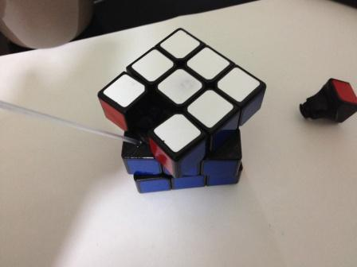
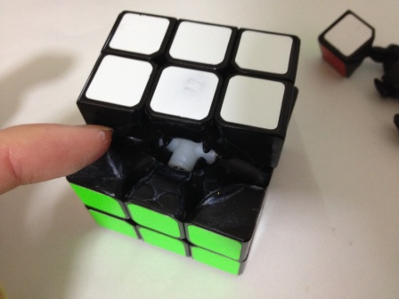
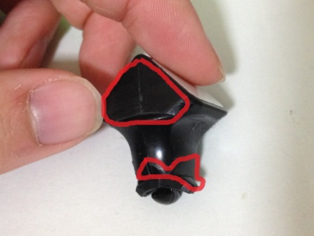
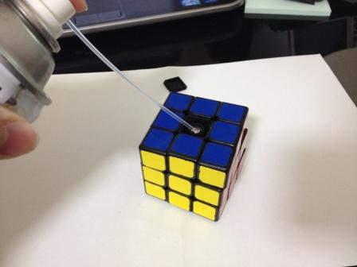

---
title: "一歩進んだメンテナンス"
date: "2015-03-09"
order: 0
---
※このページの情報は、すべて2013年現在のものです。

キューブのメンテナンスの方法は人によってまちまちで、効率的な方法などが知れ渡っているわけではありません。  
キュービストの中にはほとんどメンテナンスを行わない人もいます。

[基本的な方法については中級編にも記載している](/how-to-solve/intermediate/maintenance/)のですが、このページはそこから一歩進んで、より効果的なメンテナンスを行うためのノウハウを皆さんに伝授したいと思います。

### メンテナンスは何のためにやるのか

**そもそも、メンテナンスの目的は何でしょうか？**

「んなもんキューブを良くするために決まってるだろう」  
と思うかもしれませんが、これには少し勘違いが含まれています。

まず、基本的には**メンテナンスでキューブが良くなるかどうかは全くわかりません。**  
内部のホコリを取ったら回転が軽くなりすぎて使えなくなったとか、シリコンスプレーを差したら回転がヌルヌルし過ぎて好みじゃなくなった、という経験も人によってはあると思います。  
**メンテナンスによってキューブが良くなる保証はどこにもありません。**そもそもキューブの状態の好みは人によっても全く異なりますから、**「確実にキューブを良くする方法」などありはしない**のです。  
また、**メンテナンスは基本的に後戻りはできません。**前の状態の方が良かったと思っても、前の状態に戻すことはできないのです。

正しいメンテナンスの目的とは、  
**「キューブの状態を大きく変えるため」**  
です。  
普段の練習でも少しずつ回し心地は変化していきますが、それだけでなく一度に状態を大きく変化させることで、**「良いキューブになるかもしれない」というギャンブル**を行うのです。**良くなったらラッキー**、なのです。これが正しい「メンテナンスの目的」です。  
(もちろん経験によって成功率を上げることはできますが、100%にすることはできません。また、回し心地が良くなったからといって一番よいキューブになるとは限りません。)

### メンテナンスをいつ行うか？

ここが最も大事なポイントです。  
**基本的には、自分がメインで使っているキューブには一切メンテナンスをしません。**

今自分がメインで使っているキューブ(以下「メインキューブ」と呼びます)は、それの回し心地に自分が自然と慣れていきます。使っているうちに回し心地は少しずつ変化しているのですが、大抵の場合「慣れている回し心地」もそれに合わせて知らず知らずのうちに少しずつ変化してしまっています。ですのでそれをメンテナンスしてしまうと、**急に回し心地が変化してしまうので戸惑い**、タイムが下がってしまったり、極端に状態が悪くなればやる気の低下にもつながります。

ですので、**基本的にはメインキューブはそのままにしておいて、新しく買ったキューブや、サブのキューブに対してメンテナンスを行っていきましょう。**メンテナンスの結果「メインよりも良くなった」と感じたら、それをメインに切り替えればよいのです。

### キューブの運用方法

メンテナンスして自分好みの状態になったキューブは、出来ればその状態を長く保って使いたいものです。そのためのポイントは大きく2つです。  
一つは先ほど言った**「メンテはしない」**ということ、もう一つは**「放置しない」**ということです。

正確な原因は不明ですが、キューブを回さず放置しておくとそれだけで変化の要因になります。逆に、**ある程度回し続けていた方が変化はしにくい**のです。  
(実は変化の度合いは同じで変化に気付きにくいだけということも考えられますが、どちらにせよ結果は同じです。)  
キューブ、特に使う予定のあるキューブを全く回さない状態で長期間(だいたい数週間〜)放置しておくのは危険です。回す時間がとれなくても、時々は回すことによって状態を保っておきましょう。

### キューブの成長、寿命について

キューブは基本的に消耗品であり、使うことによって状態が変化していきます(これによりキューブが好ましい状態になっていく事を**「成長」**と呼びます)。また、寿命という概念もあります。回しすぎるとキューブが良くない状態へと変わっていきます。POPやピボットをするようになったり、全体がグニャっとするようになったり、回転がとても重くなったりします。こうなった状態をキューブの**「寿命」**といい、こうなってしまったらキューブの替え時です。  
最近のキューブは性能の向上や潤滑剤の普及により初期状態が非常に良く、また寿命は非常に長くなっていますが、それでも成長や寿命というものはあります。

メンテナンスにおいては**成長、寿命といった概念を理解しておくことが大事**です。これにより、効率のいいメンテナンスが出来るようになります。

### 自然研磨について

自然研磨とは、普段のソルブによってキューブが削れ、こなれていくことです。先ほどの「成長」とほぼ同義だと思って下さい。  
よく引っかかる部分が削れやすいので、これによりキューブが引っかかりにくくなることが多いです。また回転時に接触している部分が少しずつザラついてくるので、回転は重くなっていきます。最近のキューブは初期状態だと回転が軽すぎることが多いので、一般的にはこれは良いこととされています。

上記二つの要因により、**基本的に自然研磨はキューブを良い状態に持っていきます。**  
下手にメンテナンスするより自然研磨のほうが確実なため、自然研磨しか行わない人や、自然研磨を早めるために初期はわざと潤滑剤を入れずに使う人もいます。

ただ自然研磨の効果を実感するにはそれなりに回数を回さないといけません(3x3x3ならソルブを1000回〜程度)。その上そこまで状態を持って行くためには**ベストではない状態のキューブを長期間使用せねばならず、回し心地が悪いためやる気の低下にもつながりかねません。**  
また自然研磨も度を越すとキューブが寿命になってしまい、逆に回しにくくなります。**基本的にはキューブの寿命を縮める行為ですので、やりすぎは禁物**なのです。  
ですので、**自然研磨はうまく利用してやることが大事です。**  
いい具合に削れたら潤滑剤を入れることによって自然研磨の進行を防いだり、ある程度メンテして良い状態になってから自然研磨に頼るなどの工夫をし、自然研磨を上手く利用してキューブをより良い状態にしましょう。

### 各種潤滑剤の使い方

潤滑剤としてよく使われるのは、**シリコンスプレーとシリコングリース**です。  
シリコンスプレーは回転を滑らかにする効果と、磨耗を防ぐ効果があります。シリコングリースは回転を重くする効果があります。**両方を場合に応じて使い分けることで、キューブを自分好みの状態にする**ことができます。  
また潤滑剤を効果的に使うためには、**入れ方にも工夫が必要**です。  
シリコンスプレーは、一度エッジを外して接触面に当てながら指すのが効果的です。

シリコングリースも一度パーツを外し、グリースを接触面に指で塗り込んでいくと効果がよく表れます。  

DaYan ZhanChiだと、特に写真で示した場所に塗るのが効果的です。  

### センター調整について

まず基本として、**センターはなるべく6面で同じ締め方にする**のがよいです。triboxさん含めた**パズルショップから届いたままの状態では、締め方が均等でない場合がほとんど**です。可能なら一度全て分解し、実際にネジの部分を見ながらおおよそ同じになるよう調整をしていきましょう。  
また、どれくらいセンターを締めるかというところですが、基本的には**「ギリギリ引っかからない硬さ」に締める**のがよいです。**回転の軽さは潤滑剤を用いて調整していくことができる**ので、センター調整では引っかかりなどの具合を優先して調整していきましょう。

さらにこれはあまり知られていませんが、センターの重要な要素として**「センターそのものの回転の重さ」**というものがあります。  
センターだけ取り出して回してみると分かりますが、面によってセンター自体の回転の重さが異なる場合が結構あります。これは主に**バネとネジ、ワッシャーの摩擦**によるもので、ここによっても回転の重さが変化します。  
回転させるとバネがチキチキと音を立てるキューブを使ったことはないでしょうか？これもバネの接触によるもので、これが起こっている場合センターの回転が非常に重い場合が多いです。

これを治す方法はいくつかありますが、最も簡単な方法は**ネジの部分にもシリコンスプレーを入れる**事です。これだけで回転がかなり改善され、チキチキ音も多くの場合なくなります。

それでも音が消えない場合はバネの端をヤスリで削るなどするか、バネやネジを交換してしまいましょう。

ベアリングとか入れるとどうなるんでしょうかね。あまりその辺は僕詳しくないのでわかりませんが。

### 研磨(mod)について

パーツをヤスリなどで削ることで、引っかかりを減らすことが出来ます。これを**mod（modificationの略）**といいます。特に、**ShengShouの4x4x4や5x5x5はmodをすると非常に性能が上がる**ことが知られています。  
これについては私はあまり詳しくないので説明は省きます。気になる方は自分で調べたり、実際に削って試してみたりするといいと思います。  
ただmodに関しては本当に後戻りが出来ないので、不安ならやらない方がよいでしょう。他のキュービストにいろいろ聞いてからやるのをお勧めします。

### シリコン漬けについて

シリコン漬けとはキューブのメンテナンス方法の一つで、キューブの状態を劇的に変化させる手段です。  
具体的な方法は非常に簡単です。  
**「キューブにシリコンスプレーを死ぬほど入れて、3日から1週間程度放置」**  
これだけです。

このシリコン漬けは、キューブの成長を急激に促す、いわばドーピングです。キューブが潤滑剤となじむと回転が重くヌルヌルした感じになってきますが、先に述べた「放置による変化」を利用してこれを人為的に、かつ急激に起こすのです。  
シリコン漬けは、**初期状態で回転が軽すぎる、乾きすぎているキューブに対して行うのが非常に有効**です。こういったキューブを適度にヌルヌルした状態にすることで、ソルブの際にキューブが制御しやすくなります。  
これも基本的には寿命を縮める行為なのでやる際は注意が必要ですが、良くも悪くもキューブとしての性質が劇的に変わるため、**そのままでは全く使えない、使わないキューブに対して行うのがgood**です。大化けする可能性があるので、やるだけやってみるのは十分アリだと思います。

### メンテは自己満足？

最近はキューブの素体の性能が上がりノーメンテでも十分使えるキューブが普及しているため、メンテナンスの重要性は薄れてきています。  
また、メンテについては、  
**「ちゃんとメンテしてないキューブでも速い人は速い」**  
**「メンテばっかりしてるヒマがあったら練習しろ」**  
**「メンテなんてただの自己満足だ」**  
という意見も少なからずあります。

これに関しては**僕は全面的に同意します。**  
極端に悪いキューブを使っていないかぎり、メンテナンスでタイムが劇的に伸びるなんてことはありえません。練習してたほうがタイムは伸びます。

僕が思うメンテナンスのメリットは、  
**「満足感を得る」**  
**「キューブに対して愛着がわく」**  
**そして、「結果としてキューブに対するモチベーションが上がる」**  
ということです。  
**いいキューブを自分の手で作ること、いいキューブを使うことは、大きなモチベーションアップにつながります。**それによって沢山練習すれば、いいキューブを使うことによって練習効率も上がっていますから、結果としてメンテナンスをしなかった場合より大きな練習効果を得られるかもしれません。  
しかしこれは人と場合によると思いますし、メンテが単純に面倒臭いとしか思わない人だっているでしょうから、全員がメンテナンスをしっかり行う必要があるとは僕は思いません。  
**メンテナンスはやりたいと思う人がやればいい**、そう思っています。  
そしてメンテをやりたいと思った人が、このページを参考にしてくれたら嬉しいな、と思うわけです。

### メンテで一番大事なこと

長々と書いてきましたが、最後にメンテナンスにおいて一番大事なことを書きます。

それは、**「経験が一番」**ということです。

正直言って、メンテナンスにおいて経験に優るものはありません。  
いろいろ自分で試して、自分なりにどうやればいいのか考えて、それを実践していくこと。  
キューブの練習でもなんでもそうですが、これが最も大事なことです。  
いろいろ失敗しながらでもいいのです。とにかく経験を積んでいってください。

これにておしまいです。  
お読み頂きありがとうございました。

（執筆者：[HATAMURA](/author/#hatamura)）

[このページの最上部に戻る](#)  
[前のページに戻る](../)
