---
title: "Megaminx ブロックの揃え方"
date: "2016-08-15"
order: 0
---
このページでは、メガミンクスのS2Lで重要な、ブロックの具体的な揃え方について説明しています。

### 3パーツからなるブロックの揃え方

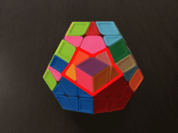  
[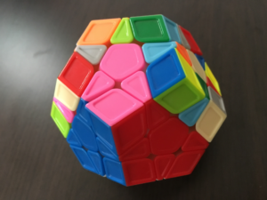](../../../../assets/2016/08/IMG_6293.png)

最も基本的なブロックです。  
いくつかの揃え方があります。

**①2パーツをF2Lの要領で先に入れ、残りのエッジを後で入れる**  
先に2パーツをF2Lの要領で組んで入れておきます。

[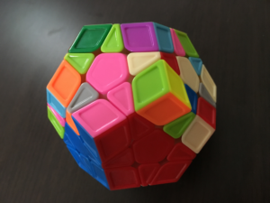](../../../../assets/2016/08/IMG_6294.png)

残りは以下のように入れます。  
（回転記号は、赤色がR面、ピンクがF面だと思ってください）

**パターン１：R' F2 R**  
[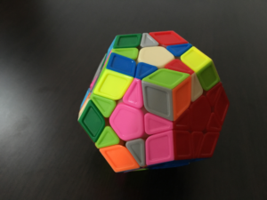](../../../../assets/2016/08/IMG_6296.png)

**パターン２：R' F R**  
[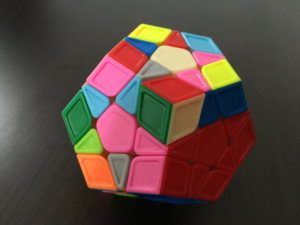](../../../../assets/2016/08/IMG_6295.png)

エッジの入れ方は他にもいろいろありますので、状況に応じてなるべく少ない手数で入れられるようになっておきましょう。

**②1パーツを先に入れ、残りをF2Lの要領で揃える**  
まず最初に、エッジを1つ入れておきます。

[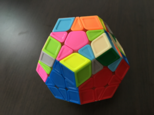](../../../../assets/2016/08/IMG_6292.png)

すると、残りをF2Lと同じような要領で入れることができます。

**③2パーツでペアを作り、残りのエッジと合わせてブロックビルディングを行う**  
2つのパーツでペアを作ったあと、残りのエッジとうまく組み合わせて入れます。

[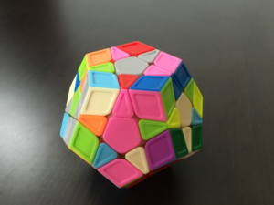](../../../../assets/2016/08/IMG_6303.png)

上手くやれば、①のやり方よりも手数を減らすことができます。  
ただこれを文章で説明するのは難しいです。経験と勘がものを言うので、頑張って練習してください。

②と③を、場合に応じて併用するのが基本となります。  
ブロックビルディングに慣れないうちは、③の代わりに①を使うのもよいでしょう。

### 5パーツからなるブロックの揃え方

[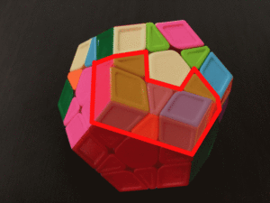](../../../../assets/2016/08/MegaS2L-013.gif)  
[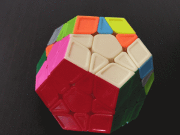](../../../../assets/2016/08/MegaS2L-002.gif)

こちらも揃える途中でよく出てくるブロックです。  
揃え方は大きく２つです。

**①中央のエッジを先に入れ、残りをF2Lの要領で揃える**  
まず、中央のエッジを先にクロスの要領で入れてしまいます。

[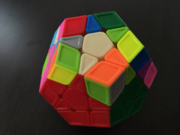](../../../../assets/2016/08/IMG_6301.png)

すると両脇にスロットが出来るので、これをF2Lの要領で入れていきます。

**②3パーツのブロックを先に作り、残りをF2Lの要領で揃える**  
3パーツをブロックビルディングの要領で組んでおきます。ここの詳細は割愛します。

[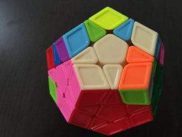](../../../../assets/2016/08/IMG_6302.png)  
残りは、F2Lと同じ要領で入れていきます。

①と②どちらの場合についても、F2L的に揃えるだけでなくブロックビルディング的な解き方をうまく使うことで、手数を少なくすることができます。

### 7パーツからなるブロックの揃え方

[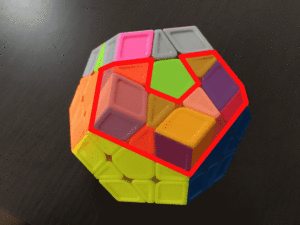](../../../../assets/2016/08/MegaS2L-014.gif)  
[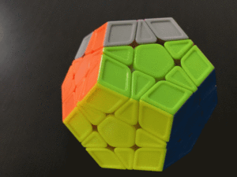](../../../../assets/2016/08/MegaS2L-005.gif)

S2Lの最後に出てくるブロックです。

基本的には、「3個のブロックを作る＋2個のペアを揃える＋2個のペアを揃える」というやり方です。  
最初に揃えるブロックの位置によって、2通りのパターンがあります。

**①中央の3パーツを先に揃える**

[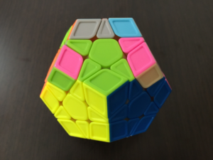](../../../../assets/2016/08/IMG_6311.png)

中央のパーツを揃えることで、両脇に２つのスロットができます。  
残りはF2Lの要領で揃えていきます。

しかし、中央の3パーツを直接揃えることはできません。  
そのため実際は、下図のように1パーツをF'ずれた位置に置いておき、  
[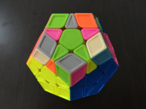](../../../../assets/2016/08/IMG_6305.png)

残りの2パーツを組み、  
[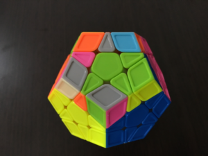](../../../../assets/2016/08/IMG_6306.png)

Fして完成、  
  
という流れで揃えていきます。

**②端の3パーツを先に揃える**

[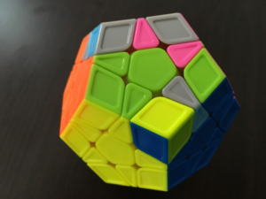](../../../../assets/2016/08/IMG_6307.png)

このように、端の3パーツを先に揃えます。  
これまでのやり方を使えば、ここは難しくないはずです。

この後は、F'でセットアップして、  
[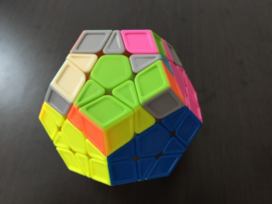](../../../../assets/2016/08/IMG_6312.png)

すでに組んだブロックの隣の2パーツを組み、  
[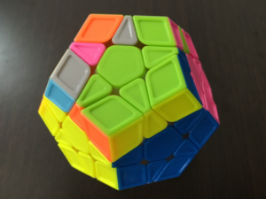](../../../../assets/2016/08/IMG_6308.png)

Fで元に戻せば、残りは①と同じになります。  
[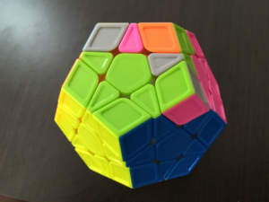](../../../../assets/2016/08/IMG_6309.png)

基本的に①のやり方をオススメしますが、その場その場に応じて②の方法もうまく使っていけるとよいですね。

**[メガミンクス　トップへ戻る](/speedcubing/other/megaminx/)**
