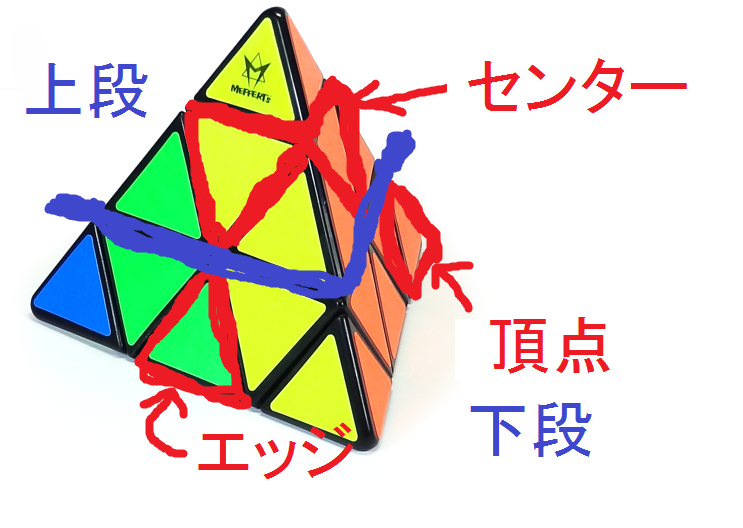

---
title: "ピラミンクス　解法の種類について"
date: "2015-03-09"
order: 0
---
この記事では、ピラミンクスの解法の分類と比較を行っています。またその上で、筆者がどの解法をオススメするか、などについても書いています。

**この記事はあくまでスピード的な側面でしか書いていません。スピード競技に向いていない解法についてはそもそも触れていませんので、その点ご了承願います。**

参考リンク：  
[http://www.speedsolving.com/wiki/index.php/Pyraminx\_methods](http://www.speedsolving.com/wiki/index.php/Pyraminx_methods)  
[http://www.speedsolving.com/forum/showthread.php?20494-Pyraminx-method-names](http://www.speedsolving.com/forum/showthread.php?20494-Pyraminx-method-names)  
（英語サイト）

上のリンクには、今回取り扱わない解法についても書いてあります。興味のある人はぜひ一度ご覧下さい。

### 用語について

まず、ややこしくならないようにパーツの名称を書いておきます。  
（この記事での名称なので、他の場所では違う呼び方がされている場合があります。）

図が汚くてすいません。

### 解法の種類

今回取り扱う解法をまず箇条書きにします。  
これらの解法はトップキューバーの間でも使われる代表的な解法です。

**・Beginner's Polish V および　Polish V  
・KeyHole method  
・岡 method  
・WO method  
・1-flip method  
・Nutella method**

### 解法の概要

解法を簡単に説明します。どうせ文章では完全には伝わらないので、おおよその説明にとどめておきます。  
もう少し詳しく知りたい方は、上のリンクを見るか、Youtubeとかで解法名で検索すれば出てきますのでそちらを参照してください。

**・Beginner's Polish V および　Polish V**  
まず、あるセンターに隣接する２つのエッジとさらにそこに隣接する２つのセンターを揃えます。  
（この形がVに見えることと、ポーランドで主に使われていることから解法の名前がついています。）  
続いてVの間に入る１つのエッジを揃えて下段を完成させ、残りの上段を揃えて完成させるのが、Beginner's Polish Vです。  
Polish Vは、Vを揃えてからの残り４つのエッジを一度に揃えてしまう方法です。パターンの数が膨大なため、解法としてはBeginner's Polish Vのほうがメジャーです。

**・KeyHole method**  
まず、あるセンターに隣接する２つのエッジを揃えます。  
続いて、揃えていないエッジの部分（KeyHoleと呼ばれます）を利用して、残りのセンターの向きを揃えます。  
さらにKeyHoleを揃えて上段を完成させたあと、残りの下段を揃えて完成です。

**・岡 method**  
KeyHoleに近いのですが、最初に揃える２つのエッジのうち片方をわざと間違った状態にします。  
センターを揃えたあとに、このエッジをうまく使って上段を完成させる解法です。

**・WO method**  
まず、上段をすべて完成させます。  
そのあと残りのセンター、残りのエッジの順に揃えていきます。

**・1-flip method**  
WOと同じく上段を全て完成させるのですが、１つのエッジだけわざと反転した状態にします。  
この反転したエッジと残りのセンターを同時に完成させ、最後に残りのエッジを揃えます。

**・Nutella method**  
これも上段を先に完成させるのですが、２つのエッジをわざと入れ替わった状態にします。  
この入れ替わったエッジと残りのセンターを同時に完成させ、最後に残りのエッジを揃えます。

### 解法の併用について

上級者は、上に挙げた解法のうち複数を併用している人が多いです。  
解法によってラッキーやアンラッキーというものが異なってくるので、常に速いタイムを出すためにスクランブルに応じて解法を使い分けているのです。特に今回挙げた解法は最初のステップから全く異なってくるため、**併用することによって各々の解法の良さがさらに際立ってくるといえるでしょう。**

一番簡単なのが、KeyHoleと岡メソッドの併用です。岡　要平(WCAID:2006OKAY01)やDrew Brads(2010BRAD01)などは、これを中心に使用しています。  
他にも、Oscar Roth Andersen(2008ANDE02)はWO、1-flip、Nutellaの３つを主に併用しているそうです。  
これら５つの解法は最初のステップが似ているので、併用がしやすいようです。

これに対し、Polish V系統の解法と他の解法を併用している人はあまりいません。  
上の説明で気づいた方もいらっしゃるかもしれませんが、Polish Vとそれ以外の解法は、上段を先に揃えるか下段を先に揃えるかで大きくアプローチが違ってきます。  
考えることやポイントがまったく変わってくるので併用は難しく、Polish Vと他の解法の併用はあまり行われません。  
ですのでPolish Vは極めたときのタイムは他と比べてどうしても劣ってしまうようです（といっても、日本トップレベルくらいまではいけます）。

### 解法のわかりやすさ

解法を習得する際に大事になってくるのが、解法のわかりやすさ、とっつきやすさです。  
どれが分かりやすいかというのは人によっても異なるのですが、筆者の感覚だとBeginner's Polish Vが一番とっつきやすいと思います。  
理由は、下段を先に揃えるという点など全体的に考え方が3x3のLBL法に近いためです。判断方法なども比較的容易に習得できます。  
これと比較して、上段を先に揃える解法は全体的に判断に慣れるまで時間がかかります。ですので、練習してすぐに速くなるのはBeginner's Polish Vであると思います。

上段を先に揃える解法では、岡およびKeyHoleと、WO・1-flip・Nutellaに分けられます。最後のエッジについてはいずれも同じですので、それまでの部分について考えます。  
KeyHoleと岡は、覚えるパターンがそれぞれ２個、３個（左右対称は１つとしてカウント）しかなく、かなり簡単です。センターの揃え方も分かりやすいですし、最初のステップで揃える部分も少ないので、比較的すぐに身につけられるでしょう。  
WO・1-flip・Nutellaについては、覚えるパターンが７パターンほどあり、自然と判断もかなり難しくなります。また、最初の上段を揃えるのも手数がかかり、かなり上級者向けの解法と言えます。  
ただ、他の解法よりステップ数がひとつ少ないぶん、極めればかなり速くなれるのは間違いないでしょう。

### どの解法を学ぶべきか

Beginner's Polish Vは簡単ですぐタイムが伸びるものの、併用が難しいぶん極めた時のタイムでは劣ります。  
岡・KeyHoleは習得はそこそこ簡単で、バランスがとれています。  
WO・1-flip・Nutellaは習得が難しく、上達するのにも時間を要します。

上記の点を踏まえて、新しくピラミンクスを始める人がどの解法を学び、使っていくべきか考えますと、  
**僕の意見では**

**・とりあえず速く揃えたいという人、コストパフォーマンスを重視する人は「Begginer's Polish V」  
・少し慣れてきた人、日本や世界を目指したい人は「KeyHole・岡 method」  
・KeyHoleや岡メソッドに慣れてさらに上を目指したい人、他の人と違うことがしたい人は「WO・1-flip・Nutella method」**

を勉強していくとよいかなと思います。  
あくまで僕の意見ですから参考程度にしてください。  
最初から岡・KeyHoleを覚えていったり、Polish Vだけを極めていくのもぜんぜんアリですし、むしろその方が向いているという人もいるでしょうから、そのへんは自分の好みでやってください。

ぶっちゃけどの解法でも切ろうと思えば５秒は切れると思いますし、**基本的には「面白そう」と思った解法を使うべき**でしょう。**やりたくもない解法を使うのはモチベーション的にもよくありません。**  
特にこだわりが無いという人は、上の目安を参考にして頂ければと思います。

(2014/08/05 執筆者：HATAMURA）

[このページの最上部に戻る](#)  
[ピラミンクス　トップに戻る](../)
